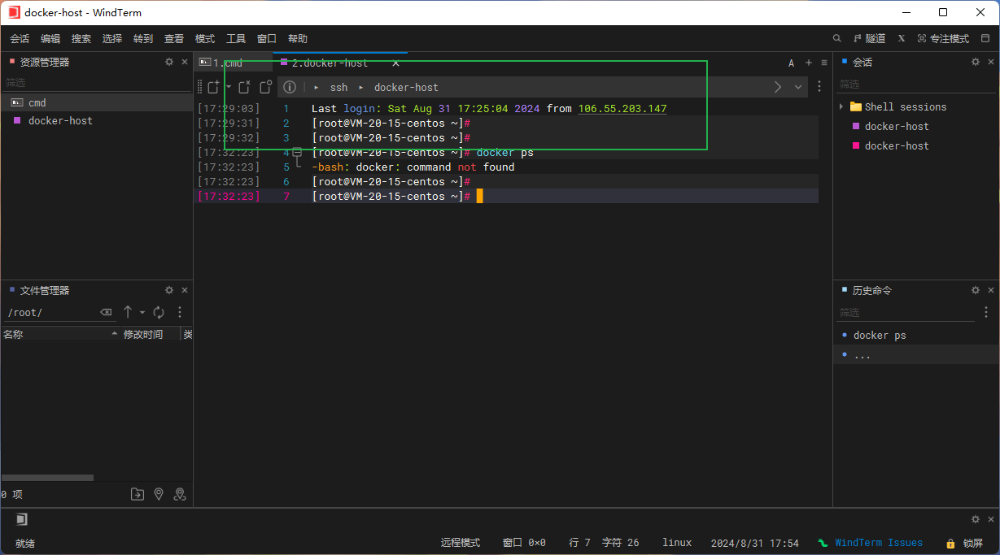

## 1.Docker 简介

### 1.介绍

Docker 是一个开源的应用容器引擎，基于 [Go 语言](https://www.runoob.com/go/go-tutorial.html) 并遵从 Apache2.0 协议开源。

Docker 可以让开发者打包他们的应用以及依赖包到一个轻量级、可移植的容器中，然后发布到任何流行的 Linux 机器上，也可以实现虚拟化。

容器是完全使用沙箱机制，相互之间不会有任何接口（类似 iPhone 的 app）,更重要的是容器性能开销极低。

### 2.需要了解的知识

在阅读本教程前，你需要掌握 Linux 的常用命令。你可以通过  [Linux 教程](https://www.runoob.com/linux/linux-tutorial.html)  来学习相关命令。

### 3.Docker 的应用场景

- Web 应用的自动化打包和发布。
- 自动化测试和持续集成、发布。
- 在服务型环境中部署和调整数据库或其他的后台应用。
- 从头编译或者扩展现有的 OpenShift 或 Cloud Foundry 平台来搭建自己的 PaaS 环境。

### 4.相关链接

Docker 官网：[https://www.docker.com](https://www.docker.com/)

Github Docker 源码：<https://github.com/docker/docker-ce>

Docker hub ：https://hub.docker.com/

## 2.Docker 架构

Docker 包括三个基本概念:

- **镜像（Image）**：Docker 镜像（Image），就相当于是一个 root 文件系统。比如官方镜像 ubuntu:16.04 就包含了完整的一套 Ubuntu16.04 最小系统的 root 文件系统。
- **容器（Container）**：镜像（Image）和容器（Container）的关系，就像是面向对象程序设计中的类和实例一样，镜像是静态的定义，容器是镜像运行时的实体。容器可以被创建、启动、停止、删除、暂停等。
- **仓库（Repository）**：仓库可看成一个代码控制中心，用来保存镜像。

Docker 使用客户端-服务器 (C/S) 架构模式，使用远程 API 来管理和创建 Docker 容器。

Docker 容器通过 Docker 镜像来创建。

## 3.Linux

### 1.CentOS 常用命令

#### 1.文件与目录操作

| 命令                    | 解析                                                               |
| ----------------------- | ------------------------------------------------------------------ |
| cd /home                | 进入 ‘/home’ 目录                                                  |
| cd ..                   | 返回上一级目录                                                     |
| cd ../..                | 返回上两级目录                                                     |
| cd -                    | 返回上次所在目录                                                   |
| cp file1 file2          | 将 file1 复制为 file2                                              |
| cp -a dir1 dir2         | 复制一个目录                                                       |
| cp -a /tmp/dir1 .       | 复制一个目录到当前工作目录（.代表当前目录）                        |
| ls                      | 查看目录中的文件                                                   |
| ls -a                   | 显示隐藏文件                                                       |
| ls -l                   | 显示详细信息                                                       |
| ls -lrt                 | 按时间显示文件（l 表示详细列表，r 表示反向排序，t 表示按时间排序） |
| pwd                     | 显示工作路径                                                       |
| mkdir dir1              | 创建 ‘dir1’ 目录                                                   |
| mkdir dir1 dir2         | 同时创建两个目录                                                   |
| mkdir -p /tmp/dir1/dir2 | 创建一个目录树                                                     |
| mv dir1 dir2            | 移动/重命名一个目录                                                |
| rm -f file1             | 删除 ‘file1’                                                       |
| rm -rf dir1             | 删除 ‘dir1’ 目录及其子目录内容                                     |

#### 2.查看文件内容

| 命令                  | 解析                                                                            |
| --------------------- | ------------------------------------------------------------------------------- |
| cat file1             | 从第一个字节开始正向查看文件的内容                                              |
| head -2 file1         | 查看一个文件的前两行                                                            |
| more file1            | 查看一个长文件的内容                                                            |
| tac file1             | 从最后一行开始反向查看一个文件的内容                                            |
| tail -3 file1         | 查看一个文件的最后三行                                                          |
| vi file               | 打开并浏览文件                                                                  |
| echo “666” > test.txt | 写入 666 到 test.txt,一个 > 表示覆盖原有文本内容：两个 > 表示往文本中追加内容。 |
| vi/vim file           | 编辑文件 shift+:wq(退出编辑保存)；shift+:q(退出编辑)；shift+:q!(强制退出)       |
| pwd                   | 查看当前路径                                                                    |

#### 3.文本内容处理

| 命令                 | 解析                                                                                                     |
| -------------------- | -------------------------------------------------------------------------------------------------------- |
| grep str /tmp/test   | 在文件 ‘/tmp/test’ 中查找 “str”                                                                          |
| grep ^str /tmp/test  | 在文件 ‘/tmp/test’ 中查找以 “str” 开始的行                                                               |
| grep [0-9] /tmp/test | 查找 ‘/tmp/test’ 文件中所有包含数字的行                                                                  |
| grep str -r /tmp/\*  | 在目录 ‘/tmp’ 及其子目录中查找 “str”                                                                     |
| diff file1 file2     | 找出两个文件的不同处                                                                                     |
| sdiff file1 file2    | 以对比的方式显示两个文件的不同                                                                           |
| vi file              | 操作解析 i 进入编辑文本模式 Esc 退出编辑文本模式:w 保存当前修改:q 不保存退出 vi:wq 保存当前修改并退出 vi |
| rz                   | 运行该命令会弹出一个文件选择窗口，从本地选择文件上传到 Linux 服务器                                      |
| sz filename          | 将选定的文件发送（send）到本地机器。                                                                     |

#### 4.查询操作

| 命令                                             | 解析                                              |
| ------------------------------------------------ | ------------------------------------------------- |
| find / -name file1                               | 从 ‘/’ 开始进入根文件系统查找文件和目录           |
| find / -user user1                               | 查找属于用户 ‘user1’ 的文件和目录                 |
| find /home/user1 -name \*.bin                    | 在目录 ‘/ home/user1’ 中查找以 ‘.bin’ 结尾的文件  |
| find /usr/bin -type f -atime +100                | 查找在过去 100 天内未被使用过的执行文件           |
| find /usr/bin -type f -mtime -10                 | 查找在 10 天内被创建或者修改过的文件              |
| locate \*.ps                                     | 寻找以 ‘.ps’ 结尾的文件，先运行 ‘updatedb’ 命令   |
| find -name ‘\*.[ch]’ \| xargs grep -E ‘expr’     | 在当前目录及其子目录所有.c 和.h 文件中查找 ‘expr’ |
| find -type f -print0 \| xargs -r0 grep -F ‘expr’ | 在当前目录及其子目录的常规文件中查找 ‘expr’       |
| find -maxdepth 1 -type f \| xargs grep -F ‘expr’ | 在当前目录中查找 ‘expr’                           |

#### 5.压缩、解压

| 命令                            | 解析                                                                                                          |
| ------------------------------- | ------------------------------------------------------------------------------------------------------------- |
| bzip2 file1                     | 压缩 file1                                                                                                    |
| bunzip2 file1.bz2               | 解压 file1.bz2                                                                                                |
| gzip file1                      | 压缩 file1                                                                                                    |
| gzip -9 file1                   | 最大程度压缩 file1                                                                                            |
| gunzip file1.gz                 | 解压 file1.gz                                                                                                 |
| tar -cvf archive.tar file1      | 把 file1 打包成 archive.tar（-c: 建立压缩档案；-v: 显示所有过程；-f: 使用档案名字，是必须的，是最后一个参数） |
| tar -cvf archive.tar file1 dir1 | 把 file1，dir1 打包成 archive.tar                                                                             |
| tar -tf archive.tar             | 显示一个包中的内容                                                                                            |
| tar -xvf archive.tar            | 释放一个包                                                                                                    |
| tar -xvf archive.tar -C /tmp    | 把压缩包释放到 /tmp 目录下                                                                                    |
| zip file1.zip file1             | 创建一个 zip 格式的压缩包                                                                                     |
| zip -r file1.zip file1 dir1     | 把文件和目录压缩成一个 zip 格式的压缩包                                                                       |
| unzip file1.zip                 | 解压一个 zip 格式的压缩包到当前目录                                                                           |
| unzip test.zip -d /tmp/         | 解压一个 zip 格式的压缩包到 /tmp 目录                                                                         |

#### 6.yum 安装器

| 命令                           | 解析                                                  |
| ------------------------------ | ----------------------------------------------------- |
| yum -y install [package]       | 下载并安装一个 rpm 包                                 |
| yum localinstall [package.rpm] | 安装一个 rpm 包，使用你自己的软件仓库解决所有依赖关系 |
| yum -y update                  | 更新当前系统中安装的所有 rpm 包                       |
| yum update [package]           | 更新一个 rpm 包                                       |
| yum remove [package]           | 删除一个 rpm 包                                       |
| yum list                       | 列出当前系统中安装的所有包                            |
| yum search [package]           | 在 rpm 仓库中搜寻软件包                               |
| yum clean [package]            | 清除缓存目录（/var/cache/yum）下的软件包              |
| yum clean headers              | 删除所有头文件                                        |
| yum clean all                  | 删除所有缓存的包和头文件                              |

#### 7.网络相关

| 命令                                            | 解析                   |
| ----------------------------------------------- | ---------------------- |
| ifconfig eth0                                   | 显示一个以太网卡的配置 |
| ifconfig eth0 192.168.1.1 netmask 255.255.255.0 | 配置网卡的 IP 地址     |
| ifdown eth0                                     | 禁用 ‘eth0’ 网络设备   |
| ifup eth0                                       | 启用 ‘eth0’ 网络设备   |
| iwconfig eth1                                   | 显示一个无线网卡的配置 |
| iwlist scan                                     | 显示无线网络           |
| ip addr show                                    | 显示网卡的 IP 地址     |

#### 8.系统相关

| 命令                                           | 解析                                               |
| ---------------------------------------------- | -------------------------------------------------- |
| su -                                           | 切换到 root 权限（与 su 有区别）                   |
| shutdown -h now                                | 关机                                               |
| shutdown -r now                                | 重启                                               |
| top                                            | 罗列使用 CPU 资源最多的 linux 任务 （输入 q 退出） |
| pstree                                         | 以树状图显示程序                                   |
| man ping                                       | 查看参考手册（例如 ping 命令）                     |
| passwd                                         | 修改密码                                           |
| df -h                                          | 显示磁盘的使用情况                                 |
| cal -3                                         | 显示前一个月，当前月以及下一个月的月历             |
| cal 10 1988                                    | 显示指定月，年的月历                               |
| date –date ‘1970-01-01 UTC 1427888888 seconds’ | 把一相对于 1970-01-01 00:00 的秒数转换成时间       |
| systemctl                                      |                                                    |
| chmod -R 777 file                              | 权限指令 递归调用 可读可写可执行                   |
|                                                |                                                    |
|                                                |                                                    |

### 2.Ubantu 常用命令

## 4.Docker 常用指令

### 1.容器管理

- `docker run <image>`：运行一个新的容器
- `docker start <container>`：启动一个已停止的容器
- `docker stop <container>`：停止一个正在运行的容器
- `docker restart <container>`：重启一个容器
- `docker rm <container>`：删除一个容器
- `docker ps`：列出当前正在运行的容器
- `docker ps -a`：列出所有容器，包括停止的容器

### 2.镜像管理

- `docker images`：列出本地的镜像
- `docker pull <image>`：下载一个镜像
- `docker push <image>`：将一个镜像推送到远程仓库
- `docker build -t <image> <path>`：根据 Dockerfile 构建一个镜像
- `docker rmi <image>`：删除一个本地的镜像

### 3.日志和输出

- `docker logs <container>`：查看容器的日志
- `docker exec -it <container> <command>`：在正在运行的容器中执行命令
- `docker cp <container>:<path> <local_path>`：将容器中的文件复制到本地

### 4.网络和端口

- `docker network ls`：列出 Docker 网络
- `docker network create <network>`：创建一个新的 Docker 网络
- `docker network connect <network> <container>`：将容器连接到指定的网络
- `docker port <container>`：显示容器的端口映射

### 5.数据管理

- `docker volume ls`：列出 Docker 卷
- `docker volume create <volume>`：创建一个新的 Docker 卷
- `docker volume inspect <volume>`：查看卷的详细信息
- `docker volume rm <volume>`：删除一个 Docker 卷

### 6.其他常用指令

- `docker info`：显示系统信息
- `docker logs <container>`：获取容器的 log 信息
- `docker inspect <container>`：显示一个容器的具体配置信息命令

## 5.Docker （CentOS）

国内常见云平台：

- [阿里云](https://promotion.aliyun.com/ntms/act/ambassador/sharetouser.html?userCode=50sid5bu&utm_source=50sid5bu)、[腾讯云](https://curl.qcloud.com/iyFTRSJb)、[华为云](https://activity.huaweicloud.com/discount_area_v5/index.html?fromacct=d1a6f32e-d6d0-4702-9213-eafe022a0708&utm_source=bGVpZmVuZ3lhbmc==&utm_medium=cps&utm_campaign=201905)、[青云](https://www.qingcloud.com/)......

使用 `CentOS 7.6`

`WindTerm`下载：<https://github.com/kingToolbox/WindTerm/releases/download/2.6.0/WindTerm_2.6.1_Windows_Portable_x86_64.zip>

`windTerm`是一款开源的终端工具，跨平台支持`Windows`、`Linux`和`macOS`。它在 SSH 和 SFTP 性能上表现出色，提供文件上传、智能提示等功能，并集成 SFTP，无需额外软件。此外，WindTerm 还拥有自动补全、主题切换及自动复制等实用特性，为用户带来高效便捷的终端体验。

使用终端最重要的一个场景就是 SSH，连接远程服务器。

### 1.使用 WindTerm 登入




### 2.安装 Docker

参照官网

https://docs.docker.com/engine/install/centos/

依次执行命令

```shell
# 移除旧版本docker （如果有）

sudo yum remove docker \
                  docker-client \
                  docker-client-latest \
                  docker-common \
                  docker-latest \
                  docker-latest-logrotate \
                  docker-logrotate \
                  docker-engine


# 配置docker yum源 下载源。

sudo yum install -y yum-utils
sudo yum-config-manager \
--add-repo \
http://mirrors.aliyun.com/docker-ce/linux/centos/docker-ce.repo


# 安装 最新 docker docker-compose等

sudo yum install -y docker-ce docker-ce-cli containerd.io docker-buildx-plugin docker-compose-plugin

# 启动& 开机启动docker； enable + start 二合一

systemctl enable docker --now

# 配置image镜像加速

sudo mkdir -p /etc/docker
sudo tee /etc/docker/daemon.json <<-'EOF'
{
  "registry-mirrors": ["https://x7xg7a50.mirror.aliyuncs.com"]
}
EOF
sudo systemctl daemon-reload
sudo systemctl restart docker

//如果上面被墙了，用下面这个

sudo mkdir -p /etc/docker
sudo tee /etc/docker/daemon.json <<-'EOF'
{
"registry-mirrors": [
"https://docker.1ms.run",
"https://do.nark.eu.org",
"https://dc.j8.work",
"https://docker.m.daocloud.io",
"https://dockerproxy.com",
"https://docker.mirrors.ustc.edu.cn",
"https://docker.nju.edu.cn"
]
}
EOF
sudo systemctl daemon-reload
sudo systemctl restart docker
```


至此 Docker 已经安装到你的 CentOS 环境中。

### 3.命令 - 镜像操作

完成： 启动一个 nginx，并将它的首页改成自己的页面 ，发布出去，让别人看见

```sh
 #查看命令帮助
 xx --help
#查看运行中的容器
docker ps
#查看所有容器
docker ps -a
#搜索镜像
docker search nginx
#下载镜像
docker pull nginx
#下载指定版本镜像 docker pull [name]：[tag]
docker pull nginx:1.26.0
#查看所有镜像
docker images
#删除指定id的镜像  docker rmi [id]
docker rmi e784f4560448


#运行一个新容器
docker run nginx
#停止容器  docker stop [name/ id]
 docker stop  keen_blackwell
#启动容器 docker start [id]
docker start 592
#重启容器
docker restart 592
#查看容器资源占用情况
docker stats 592
#查看容器日志
docker logs 592
#删除指定容器
docker rm 592
#强制删除指定容器
docker rm -f 592
# 后台启动容器  docker run  [-d: 后台运行容器并返回容器 ID。] [--name: 给容器指定一个名称。] [-p: 端口映射，格式为 host_port:container_port。] images
docker run -d --name chennginx nginx
# 后台启动并暴露端口
docker run -d --name chennginx -p 80:80 nginx
# 进入容器内部    -it  /bin/bash : 以交互模式运行容器，并启动一个 Bash shell。
docker exec -it chennginx /bin/bash
#or
docker exec -it chennginx bash
#查看dockerhub nginx在容器内的位置  /usr/share/nginx/html
#进入目录
cd /usr/share/nginx/html
#查看目录
ls
#打开并浏览文件index.html
vi index.html
#发现打不开，使用echo "" > index.html
echo "hello nginx" > index.html
#查看文件的内容,输出 hello nginx
cat index.html
#这里后面会使用数据卷映射，直接将容器内部的文件夹直接映射到外部文件中，直接在外部改文件 比如nginx.config文件，容器内部就生效。
#退出当前容器
exit     or   ctrl+D


# 提交容器变化打成一个新的镜像 docker commit [-m 说明 ] CONTAINER  [REPOSITORY[:TAG]]
docker commit -m "update index.html" chennginx chennginx:1.0
# 保存镜像为指定文件 docker save [OPTIONS -o, --output: 指定输出文件的路径] IMAGE [IMAGE...]
docker save -o chennginx.tar chennginx:1.0
#查看当前位置的tar
ls
# 删除多个镜像
docker rmi bde7d154a67f 94543a6c1aef e784f4560448
#或者
docke rm -f $(docker ps -aq)
# 加载镜像  -i, --input: 指定输入文件的路径
docker load -i chennginx.tar
#后台重新启动容器
docker run -d --name chennginx -p 80:80 chennginx:.0


# 登录 docker hub
docker login
# 重新给镜像打标签 docker tag SOURCE_IMAGE[:TAG] TARGET_IMAGE[:TAG]
docker tag chennginx:1.0 chenjw1212/chennginx:1.0
# 推送镜像  目前可能被墙了 推不上去
docker push chenjw1212/chennginx:1.0
#指定最新版本
docker tag chennginx:1.0 chenjw1212/chennginx:latest
#推送最新版本
docker push chenjw1212/chennginx:latest
```


### 4.存储

#### 修改容器内部文件存在的问题

容器可以理解为一个小的 linux 系统，容器内部拥有独立的文件系统。

**问题 1**：当我们修改容器内文件时候很麻烦，只能通过 echo 命令去修改，**修改不容易**

**问题 2**：当我们销毁容器的时候，当我们只是进入容器修改文件，**会出现数据丢失问题**

#### 解决办法

##### 1.目录挂载：

```sh
-v /app/nghtml:/usr/share/nginx/html
```

将容器内部的`nginx`的`/usr/share/nginx/html`目录挂载到主机(linux 服务器)的`/app/nghtml`目录


**注意！！！**
有一个问题，当使用了目录挂载的方式后，容器启动的时候，如果主机中的文件夹中的文件不存在，那么就会报错，需要提前创建好目录内的文件。这一点还是比较麻烦！于是才有了数据卷映射。

##### 2.卷映射

将容器内部的文件夹直接映射到外部文件中，直接在外部改文件 比如 nginx.config 文件，容器内部就生效

两种方式，注意区分：

- 目录挂载： `-v /app/nghtml:/usr/share/nginx/html` ，/app/nghtml 是目录位置，目录挂载是以外部文件为准，容器初始启动，如果外部目录下是空的，则容器内对应文件是空的
- 卷映射：`-v ngconf:/etc/nginx` ，ngconf 是卷名，docker 会自动创建一个存储位置， 以容器内部文件夹为准， 容器初始启动，如果内部有数据会自动映射到外部

```sh
docker run -d -p 99:80 \
-v /app/nghtml:/usr/share/nginx/html \
-v ngconf:/etc/nginx \
--name app03 \
nginx
```

docker 会将卷的位置放到主机的 `/var/lib/docker/volumes/<volumes-name>`下

```sh
cd /var/lib/docker/volumes/ ngconf
cd ngconf /
ls
cd _data /
#查看映射的文件
ls
vi nginx.conf
shift+:wq(退出编辑保存)
```

docker 卷操作命令

```sh
#查看卷
docker volume ls
#创建cc卷
docker volume create cc
#查看ngconf卷详情
docker volume inspect ngconf
```

容器删除，主机的 目录 和 卷 都有不会被删除

### 4.网络

`docker`启动会为每个容器分配`唯一ip`，使用`容器ip+容器端口` 可以互相访问,

但是 ip 由于各种原因，可能会变化，

那就可以通过`域名`访问，那就需要创建自定义网络，实现主机名作为稳定域名访问。

`docker0`默认不支持主机域名

创建自定义网络，容器名就是稳定域名

#### ip 访问

容器默认都是加入`docker0`网络，不支持主机域名

`docker0`是安装`docker`自动生成的一个网络，默认 ip 地址是`172.17.0.1`这个地址

容器之间可以通过各自分配的 ip 进行访问

```sh
#能够查看到docker0这个网络
ip a
#创建两个容器
docker run -d --name app1 -p 80:80 nginx
docker run -d --name app2 -p 88:80 nginx  //需要打开服务器安全组88端口
#各个容器有默认分配的ip网络
docker container inspect app1
#进入app1容器
docker exec -it app1 bash
#app1中使用curl连接 app2的ip:端口
curl http://172.17.0.3:80
```

这样，app1 通过 ip 就访问到了 app2


#### 自定义网络

容器默认都是加入`docker0`网络，不支持主机域名，那么我们需要创建一个自定义网络，来实现通过域名访问

```sh
#创建自定义网络
docker network create mynet
#查看网络  briage就是docker0
docker network ls
#创建两个容器加入自定义网络
docker run -d -p 88:80 --name app1 --network mynet nginx
docker run -d -p 80:80 --name app2 --network mynet nginx
#查看容器详情
docker inspect app1
#进入app1容器
docker exec -it app1 bash
#app1中使用curl连接 app2的容器名+端口
curl http://app2:80
```


##### 利用自定义网络实现一个 redis 主从同步集群

```sh
#自定义网络
docker network create mynet
#主节点
docker run -d -p 6379:6379 \
-v /app/rd1:/bitnami/redis/data \
-e REDIS_REPLICATION_MODE=master \
-e REDIS_PASSWORD=123456 \
--network mynet --name redis01 \
bitnami/redis

#从节点
docker run -d -p 6380:6379 \
-v /app/rd2:/bitnami/redis/data \
-e REDIS_REPLICATION_MODE=slave \
-e REDIS_MASTER_HOST=redis01 \
-e REDIS_MASTER_PORT_NUMBER=6379 \
-e REDIS_MASTER_PASSWORD=123456 \
-e REDIS_PASSWORD=123456 \
--network mynet --name redis02 \
bitnami/redis
```

##### 启动 MySQL

找`端口映射` `目录挂载`：

在`DockerHub`找三大要素：`配置文件路径 ` ` 数据路径` `环境变量`

```sh
docker run -d -p 3306:3306 \
-v /app/myconf:/etc/mysql/conf.d \
-v /app/mydata:/var/lib/mysql \
-e MYSQL_ROOT_PASSWORD=123456 \
mysql:8.0.37-debian
```

### 5.Docker Compose 管理容器

#### 1.介绍

为什么有`compose`？

之前我们创建容器都是需要通过敲一个一个的命令来实现容器启动,关闭等等操作，有了`Compose`就可以快速生成这些命令

`Compose` 是用于定义和运行多容器`Docker`应用程序的工具。通过 `Compose`，您可以使用`YML`文件来配置应用程序需要的所有服务。然后，使用一个命令，就可以从` YML` 文件配置中创建并启动所有服务。


#### 2.常用命令

```sh
#后台上线
docker compose up -d
docker compose -f aaa.yaml up -d
#下线
docker compose down

#重新启动
docker compose start redis mysql app1
#停止
docker compose stop redis mysql app1
#扩容 再创建2个app1容器
docker compose scale app1=3
```

#### 3.案例 wordpress+mysql

##### 1.命令式安装


```sh
#创建网络
docker network create blog

#启动mysql
docker run -d -p 3306:3306 \
-e MYSQL_ROOT_PASSWORD=123456 \
-e MYSQL_DATABASE=wordpress \
-v mysql-data:/var/lib/mysql \
-v /app/myconf:/etc/mysql/conf.d \
--restart always --name mysql \
--network blog \
mysql:8.0

#启动wordpress
docker run -d -p 8080:80 \
-e WORDPRESS_DB_HOST=mysql \
-e WORDPRESS_DB_USER=root \
-e WORDPRESS_DB_PASSWORD=123456 \
-e WORDPRESS_DB_NAME=wordpress \
-v wordpress:/var/www/html \
--restart always --name wordpress-app \
--network blog \
wordpress:latest
```

--restart always --name mysql 容器随着 docker 启动而启动

##### 2. 配置 compose.yaml

docker compose api：https://docs.docker.com/reference/compose-file/

顶级元素

| 名称     | 中文 |
| -------- | ---- |
| name     | 名字 |
| version  | 版本 |
| services | 服务 |
| networks | 网络 |
| volumes  | 卷   |
| configs  | 配置 |
| secrets  | 密钥 |

```sh
name: myblog
services:
  mysql:
    container_name: mysql
    image: mysql:8.0
    ports:
      - "3306:3306"
    environment:
      - MYSQL_ROOT_PASSWORD=123456
      - MYSQL_DATABASE=wordpress
    volumes:
      - mysql-data:/var/lib/mysql
      - /app/myconf:/etc/mysql/conf.d
    restart: always
    networks:
      - blog

  wordpress:
    image: wordpress
    ports:
      - "8080:80"
    environment:
      WORDPRESS_DB_HOST: mysql
      WORDPRESS_DB_USER: root
      WORDPRESS_DB_PASSWORD: 123456
      WORDPRESS_DB_NAME: wordpress
    volumes:
      - wordpress:/var/www/html
    restart: always
    networks:
      - blog
    depends_on:
      - mysql

volumes:
  mysql-data:
  wordpress:

networks:
  blog:
```

```sh
#编辑文件（没有则创建）
vim aaa.yaml
#查看列表
ls
#查看卷轴
docker volume ls
#删除卷
docker volume rm mysql-data wordpress
#查看网络
docker network ls
#删除网络
docker network rm blog
#后台启动compose文件
docker compose -f aaa.yaml up -d
```

#### 4.特性

- 增量更新

- - 修改 Docker Compose 文件。重新启动应用。只会触发修改项的重新启动。

- 数据不删

- - 默认就算 down 了容器，所有挂载的卷不会被移除。比较安全

### 6.Dockerfile 制作镜像

https://docs.docker.com/reference/dockerfile/

##### 1.图解

制作镜像主要考虑 `基础环境` `软件包` `启动命令`等


##### 2.实现指令

| 常见指令       | 作用                                                         |
| :------------- | ------------------------------------------------------------ |
| **FROM**       | **指定镜像基础环境**                                         |
| RUN            | 运行自定义命令，等同于终端shell命令                          |
| CMD            | 容器启动命令或参数                                           |
| **LABEL**      | **自定义标签**                                               |
| **EXPOSE**     | **指定当前容器对外暴露的端口**                               |
| ENV            | 环境变量                                                     |
| ADD            | 将宿主机目录下的文件拷贝到镜像且会自动处理URL和解压tar压缩包 |
| **COPY**       | 类似ADD，拷贝文件和目录到镜像中。将从构建上下文目录中<源路径>的文件或目录复制到新的一层的镜像内的<目标路径> |
| **ENTRYPOINT** | **容器固定启动命令**                                         |
| VOLUME         | 数据卷                                                       |
| USER           | 指定该镜像以什么样的用户去执行，（不指定为root）             |
| WORLDIR        | 指定在创建容器后，终端默认登录进来的工作目录                 |
| ARG            | 指定构建参数                                                 |

##### RUN

  容器启动命令或参数 

 格式：

- shell格式
- exec格式 

~~~~sh
RUN ["可执行文件"，"参数1"，"参数2" ]
# 比如：
RUN ["java","-jar",".app.jar"] 等价 RUN java -jar /app.jar
~~~~


RUN是在docker build的时候运行


##### ENV

~~~~sh
ENV HOME /user

WORLDIR $HOME
~~~~


##### ADD COPY


###### 1.ADD

~~~~sh
#ADD <src>... <dest>
#ADD支持URL作为参数
ADD /foo.tar.gz /tmp/

ADD http://foo.com/bar.go /tmp/
~~~~

###### 2.COPY

~~~~~sh
#COPY <src>... <dest>
#COPY不支持URL作为参数，因此它不能用于从远程位置下载文件。任何想要复制到容器中的东西都必须存在于本地构建上下文中。
#COPY实际上只是ADD的精简版本，旨在满足大部分“复制文件到容器”的使用案例而没有任何副作用

#将从构建上下文目录中<源路径>的文件或目录复制到新的一层的镜像内的<目标路径>
# <src源路径> :源文件或源目录      <dest目标路径>：容器内的指定路径，该路径不用事先建好，会自动创建
COPY src dest
copy ["src" ,"dest"]
~~~~~

###### 3.ADD vs COPY

COPY实际上只是ADD的精简版本，旨在满足大部分“复制文件到容器”的使用案例而没有任何副作用 .

Docker团队的建议是在几乎所有情况下都使用COPY .

ADD支持URL作为参数，CPOY不支持

使用ADD的唯一原因是当你有一个压缩文件，你一定想自动解压到镜像中 ,其他时候推荐用COPY


#### ENTRYPOINT  CMD


###### 1.CMD

**定义:**

该指令用于用户启动容器时，容器来执行的命令，该命令会在容器启动且` docker run `后面没有指定其他命令时执行，所以小结三种情况：

- docker run 没指定其他命令：则启动容器时运行 `CMD` 后的命令；

- docker run 指定了其他命令：则启动容器时运行` CMD` 后的命令会被覆盖；

- Dockerfile 中有多条 `CMD` 指令时，仅最后一条生效。

  

**格式**：

- shell 格式：`CMD <二进制可执行命令> <指令1> <指令2> `如：`CMD yum install -y vim`

- exec 格式：`CMD [“二进制可执行命令”, “指令1”, “指令2”]` 如：`CMD [“yum”, “install”, “-y”, “net-tools”]`

`CMD [“a”,“b”] `格式：该格式是为` ENTRYPOINT` 提供使用，此时` ENTRYPOINT` 就必须使用 `exec `格式，否则不生效。

**其他:**

- `CMD` [ "参数1","参数2",...]，在指定了` RNTRYPOINT` 指令后，用` CMD `指定具体的参数
- `CMD是`在`docker run`的时候执行 , `RUN是`在`docker build`的时候执行

**理解:**

~~~~sh
#在host主机中,如果我们需要执行一个nginx环境,
docker run -it nginx /bin/bash

#转化为Dockerfile写法就是
CMD ["/bin/bash", "start.bash"]

#理解: CMD指令其实就是docker run 后面追加的命令
#Dockerfile的CMD ["/bin/bash", "start.bash"] 转化到宿主机中就是  docker run -it nginx /bin/bash


#又比如  我想启动 nginx 并且想看  /etc/nginx/new.conf 目录

#宿主机操作
docker run -it nginx cat /etc/nginx/new.conf 
#Dockerfile写法
CMD ["cat"," /etc/nginx/new.conf"]

~~~~


**容器内运行程序**

这里要注意:`docker`不是虚拟机的概念,虚拟机里的程序运行,基本上都是在后台运行,利用`systemctl`运行,但是容器内没有后台进程的概念,必须是**前台**运行

容器就是为了主进程而存在的,主进程如果退出了,容器也就失去了意义,自动退出


例如这里有一个经典问题

~~~~~sh
#这种写法是错误的,当你docker run 的时候 容器会立即退出,
CMD systemctl start nginx
#因为systemctl start nginx是希望以守护进程形式启动nginx,且CMD命令会转化为
CMD ["sh","-c","systemctl start nginx"]
#这样的命令主进程是sh解释器,执行完毕后立即结束了.因此容器也就退出了.

#因此正确的做法应该是 ,让nginx前台运行
CMD ["nginx","-g","daemon off"]  
CMD nginx -g daemon 0ff
~~~~~


###### 2.ENTRYPOINT	

**定义:**

与`CMD`类似,该指令用于用户启动容器时，容器来执行的命令。与`CMD `不同的是，不管 `docker run … `后是否运行有其他命令，`ENTRYPOINT` 指令后的命令一定会被执行。

**格式：**

- shell 格式：`ENTRYPOINT command param1 param2`；

- exec 格式：`ENTRYPOINT ["executable", "param1", "param2"]`。

**其他:**

- 类似于 CMD 指令 ,但是 ENTRYPOINT 不会被docker run 后面的命令覆盖,而且这些命令行参数会被当作参数传给 ENTRYPOINT 指令指定的程序
- 也是用来指定一个容器启动时要运行的命令

- `ENTRYPOINT` 可以和` CMD` 一起用 , 一般是变参才会用`CMD`,这里的`CMD `等于是在给` ENTRYPOINT` 传参.
- 当指定了 `ENTRYPOINT` 后,`CMD`的含义就发生了变化,不再是直接运行其命令而是将`CMD`的内容作为参数传递给`ENTRYPOINT`指令.


**理解:**

~~~~sh
# 当指定了 ENTRYPOINT 后,CMD的含义就发生了变化,不再是直接运行其命令而是将CMD的内容作为参数传递给ENTRYPOINT指令.


#CMD版本

#1.准备一个Dockerfile 目的是查看主机ip
FROM centos:7.8.2003
RUN rpm --rebuilddb && yum install epel-release -y
RUN rpm --rebuilddb %% yum install curl -y
CMD ["curl","-s","http://ipinfo.io/ip"]

#CMD命令就是 
docker run my_centos curl -s http://ipinfo.io/ip

#2.进入宿主机,复制进去,然后esc + :wq
vim Dockerfile 
#3.构建镜像
docker build -f Dockerfile -t my_centos:v1.0 .
#4.检查镜像
docker images
#5.运行镜像 生成容器
docker run my_centos:v1.0
#6. curl -s http://ipinfo.io/ip -I 参数,如果我突然想传 -I这个命令参数,发现报错怎么办?
docker run my_centos:v1.0 -I
#这是因为CMD指令下,docker run ... 后面的命令 -I 会覆盖掉 Dockerfile中的CMD中["curl","-s","http://ipinfo.io/ip"]  ,造成报错
docker run my_centos:v1.0 curl -s http://ipinfo.io/ip -I   
# 这样才行,但是太麻烦

# 想要正确的给容器传入一个 -I 参数怎么办?

# 解决办法 使用 ENTRYPOINT 


# ENTRYPOINT版本

#9.修改Dockerfile文件
FROM centos:7.8.2003
RUN rpm --rebuilddb && yum install epel-release -y
RUN rpm --rebuilddb %% yum install curl -y
ENTRYPOINT ["curl","-s","http://ipinfo.io/ip"]
#10.进入宿主机,复制进去,然后esc + :wq
vim Dockerfile 
#11.重新构建镜像
docker build -f Dockerfile -t my_centos:v2.0 .
#12.检查镜像
docker images
#13.运行镜像 生成容器
docker run my_centos:v2.0 -I
#等价于  将 -I 插入到  ENTRYPOINT ["curl","-s","http://ipinfo.io/ip" , "-I"],而不是CMD的覆盖
~~~~


###### 3. CMD vs ENTRYPOINT

~~~~sh
CMD指令和ENTRYPOINT指令其实本质上都是shell脚本,都是在docker run ..后面追加的参数,也可以把这个参数理解为Dockerfile的脚本
但是CMD指令下,如果docker run  nginx bash ,这个bash参数会覆盖掉dockerfile中的CMD指令
而ENTRYPOINT指令下,如果dicker run nginx bash 这个bash指令不会覆盖ENTRYPOINT指令
~~~~


##### 3.Dockerfile小案例

```sh
#Dockerfile:

FROM openjdk:17

LABEL author=leifengyang

COPY app.jar /app.jar

EXPOSE 8080
# ENTRYPOINT java -jar /app.jar
ENTRYPOINT ["java","-jar","/app.jar"]


#centos:
#编辑dockerfile（无则创建）
vim Dockerfile
ls
#查看Dockerfile内容
cat Dockerfile
#制作镜像    最后的 . 代表根目录  对应  /app.jar
docker build -f Dockerfile -t myjavaapp:v1.0 .
```


