## 1.综述

`Nestjs` 是一个用于构建高效可扩展的一个基于 `Node js` 服务端 应用程序开发框架

并且完全支持`typeScript`结合了`AOP`面向切面的编程方式

nestjs 还是一个 `spring MVC` 的风格 其中有`依赖注入`, `IOC 控制反转` 都是借鉴了 Angualr

nestjs 的底层代码运用了 express 和 Fastify 在他们的基础上提供了一定程度的抽象，同时也将其 API 直接暴露给开发人员。这样可以轻松使用每个平台的无数第三方模块

nestjs 中文文档 https://docs.nestjs.cn/10/introduction
nestjs 英文文档 https://nestjs.com/

## 2.前置知识

### AOP 面向切面编程

是一种用于将横切关注点从主要业务逻辑中分离出来的编程范式。AOP 的核心思想是通过一种称为 "切面"（Aspect）的结构化模块来模块化这些横切关注点，然后将它们应用到整个应用程序中。切面是一个包含了横切逻辑的模块，它描述了在哪里以及何时将这些横切关注点应用到代码中。

### IoC 控制反转

Inversion of Control 字面意思是控制反转，具体定义是高层模块不应该依赖低层模块，二者都应该依赖其抽象；抽象不应该依赖细节；细节应该依赖抽象。

### DI 依赖注入

依赖注入（Dependency Injection）指创建对象的过程由框架自动完成，a 对象在使用 b 对象，b 对象使用 c 对象，a 对象只需要使用 b 对象，而不需要了解 b 对象怎么怎么样创建出 c 对象。达到逻辑解耦

```
// npm install ts-node -g 可以在控制台打印ts文件
// 依赖注入

class A {
  name: string;
  constructor(name: string) {
    this.name = name;
  }
}

class B {
  name: A;
  age: number;
  constructor(age: number) {
    this.age = age;
    this.name = new A("CHEN");
  }
}

const c = new B(18);

console.log("c", c);

// 我们可以看到，B 中代码的实现是需要依赖 A 的，两者的代码耦合度非常高。当两者之间的业务逻辑复杂程度增加的情况下，维护成本与代码可读性都会随着增加，并且很难再多引入额外的模块进行功能拓展。

// 为了解决这个问题可以增加一个中间键实现解耦

class A1 {
  name: string;
  constructor(name: string) {
    this.name = name;
  }
}

class B1 {
  name: string;
  constructor(name: string) {
    this.name = name;
  }
}

//中间件用于解耦
class MiddleKey {
  modeuls: any;
  constructor() {
    this.modeuls = {};
  }
  provide(key: string, value: any) {
    this.modeuls[key] = value;
  }
  get(key: string) {
    return this.modeuls[key];
  }
}

// 将各个模块注册到中间键中
const middleKey = new MiddleKey();
middleKey.provide("A", new A1("CHEN"));
middleKey.provide("B", new B1("LI"));

class C {
  name1: string;
  name2: string;
  constructor(middleKey: MiddleKey) {
    this.name1 = middleKey.get("A");
    this.name2 = middleKey.get("B");
  }
}

// 取出对应模块
const c2 = new C(middleKey);

console.log("c2", c2);

```

### 装饰器

#### 1. 什么是装饰器?

装饰器是一种`特殊类型的声明`

它能够被附加到`类声明`，`方法`，`属性`或`参数`上，可以修改类的行为。

装饰器使用`@expression`这种形式，expression 求值后必须为一个函数，它会在运行时当作函数被调用，被装饰的声明信息做为参数传入。

类似于 `Java` 中的`注解`

**装饰器需要开启**

```
npm install ts-node -g
npm install typescript -g
tsc --init
```

需要在 `tsconfig.json `中配置` compilerOptions` 选项中添加`"experimentalDecorators": true`

#### 装饰器类型

##### 1.类装饰器

类装饰器表达式会在运行时当作函数被调用，
返回一个参数 1.原形对象

主要是通过@符号添加装饰器
他会自动把 class 的构造函数传入到装饰器的第一个参数 target
然后通过 prototype 可以自定义添加属性和方法

```

/**
 * decotators
 * @param target 类的原型对象
 */
const decotators: ClassDecorator = (target: any) => {
  console.log("target", target);
  target.prototype.name = "chen";
};

@decotators
class Person {
  name: any;
  constructor() {}
}

const p = new Person();
console.log("p", p.name);


```

##### 2.属性装饰器

属性装饰器表达式会在运行时当作函数被调用，
返回两个参数: 1.原形对象 2.属性的名称

```
/**
 *decotators2
 * @param target 类的原型对象
 * @param key  属性名
 */
const decotators2: PropertyDecorator = (target: any, key: string | symbol) => {
  console.log("target2", target, "key2", key);
};

class Person2 {
  @decotators2
  name: string; // 属性名
  @decotators2
  age: number;
  constructor() {
    this.name = "chen 1";
    this.age = 26;
  }
}
```

##### 3.参数装饰器

参数装饰器表达式会在运行时当作函数被调用，
返回三个参数: 1.原形对象 2.方法的名称 3.参数在函数参数列表中的索引

```
const decotators3: ParameterDecorator = (
  target: any,
  key: string | symbol | undefined,
  index: number
) => {
  console.log("target", target, "key", key, "index", index);
};

class Person3 {
  name: string; // 属性名
  age: number;
  constructor() {
    this.name = "chen 1";
    this.age = 26;
  }

  getName(name: string, @decotators3 age: number) {
    return this.name;
  }
}
```

##### 4.方法装饰器

参数装饰器表达式会在运行时当作函数被调用，
返回三个参数: 1.原形对象 2.方法的名称 3.属性描述符
function 方法 对应 value
可写对应 writable
可枚举对应 enumerable
可配置对应 configurable

```
const decotators4: MethodDecorator = (
  target: any,
  key: string | symbol,
  descriptor: PropertyDescriptor
) => {
  console.log("target", target, "key", key, "descriptor", descriptor);
};

class Person4 {
  name: string; // 属性名
  age: number;
  constructor() {
    this.name = "chen 1";
    this.age = 26;
  }
  @decotators4
  getName(name: string, age: number) {
    return this.name;
  }
}
```

### 装饰器实现一个 GET 请求

```
npm install axios -S
```

定义控制器 Controller

```
class Controller {
    constructor() {

    }
    getList () {

    }

}
```

```
import axios from "axios";

const Get = (url: string): MethodDecorator => { //类似于高阶函数 柯里化处理
  return (target, key, descriptor: PropertyDescriptor) => {
    console.log("target", target, "key", key, "descriptor", descriptor.value);
    const fnc = descriptor.value; //拿到对应的function
    axios
      .get(url)
      .then((res: any) => {
        fnc(res, {
          status: 200,
        });
      })
      .catch((e: any) => {
        fnc(e, {
          status: 500,
        });
      });
  };
};

class Controller {
  constructor() {}
  @Get("https://api.apiopen.top/api/getHaoKanVideo?page=0&size=10")
  getList(res: any, status: any) {
    console.log("res", res, status);
  }
}

```

**函数柯里化**

柯里化（Currying）是一种关于函数的高阶技术。
柯里化是一种函数的转换，它是指将一个函数从可调用的 f(a, b, c) 转换为可调用的 f(a)(b)(c)。
柯里化不会调用函数。它只是对函数进行转换。

看一个例子
我们将创建一个辅助函数 curry(f)，该函数将对两个参数的函数 f 执行柯里化。
换句话说，对于两个参数的函数 f(a, b) 执行 curry(f) 会将其转换为以 f(a)(b) 形式运行的函数：

```
// 柯里化
function curry(f: any) {
  // curry(f) 执行柯里化转换
  return function (a: any) {
    return function (b: any) {
      return f(a, b);
    };
  };
}

// 用法
function sum(a: any, b: any) {
  return a + b;
}

let curriedSum = curry(sum);

console.log(curriedSum(1)(2)); // 3
```

## 3.nestjs-cli

```
node版本 >= 16

$ npm i -g @nestjs/cli
$ nest new project-name
```

```
src
 ├── app.controller.spec.ts 对于基本控制器的单元测试样例
 ├── app.controller.ts      控制层,这里主要是写路由相关代码以及处理前端传来的一些参数
 ├── app.module.ts          组织应用程序中的许多功能,如控制器、服务以及可以导入其他模块等
 ├── app.service.ts         业务层,在这里写一些与业务相关的逻辑。比如对数据库的 CRUD
 └── main.ts                整个程序的入口文件
```

## 4. nestjs cli 常用命令

```
nest --help 可以查看nestjs所有的命令

      │  name         │ alias       │ description                                  │
      │ application   │ application │ Generate a new application workspace         │
      │ class         │ cl          │ Generate a new class                         │
      │ configuration │ config      │ Generate a CLI configuration file            │
      │ controller    │ co          │ Generate a controller declaration            │
      │ decorator     │ d           │ Generate a custom decorator                  │
      │ filter        │ f           │ Generate a filter declaration                │
      │ gateway       │ ga          │ Generate a gateway declaration               │
      │ guard         │ gu          │ Generate a guard declaration                 │
      │ interceptor   │ itc         │ Generate an interceptor declaration          │
      │ interface     │ itf         │ Generate an interface                        │
      │ library       │ lib         │ Generate a new library within a monorepo     │
      │ middleware    │ mi          │ Generate a middleware declaration            │
      │ module        │ mo          │ Generate a module declaration                │
      │ pipe          │ pi          │ Generate a pipe declaration                  │
      │ provider      │ pr          │ Generate a provider declaration              │
      │ resolver      │ r           │ Generate a GraphQL resolver declaration      │
      │ resource      │ res         │ Generate a new CRUD resource                 │
      │ service       │ s           │ Generate a service declaration               │
      │ sub-app       │ app         │ Generate a new application within a monorepo │


```

### 生成一个 user 模块

#### 1.生成 controller.ts

```
nest g co user  // g:generate co:controller简写

CREATE src/user/user.controller.ts (101 bytes)
CREATE src/user/user.controller.spec.ts (496 bytes)
UPDATE src/app.module.ts (332 bytes)

这样会生成一个文件在src/user/user.controller.ts
```

#### 2.生成 module.ts

```
nest g mo user

UPDATE src/app.module.ts (391 bytes)
```

#### 3.生成 service.ts

```
nest g s user

CREATE src/user/user.service.ts (92 bytes)
CREATE src/user/user.service.spec.ts (464 bytes)
UPDATE src/user/user.module.ts (159 bytes)
```

### 一键生成 CURD

```
 nest g resource user2

 ? What transport layer do you use? (Use arrow keys)
> REST API
  GraphQL (code first)
  GraphQL (schema first)
  Microservice (non-HTTP)
  WebSockets

  ? What transport layer do you use? REST API
  ? Would you like to generate CRUD entry points? (Y/n) y

  CREATE src/user2/user2.controller.ts (938 bytes)
  CREATE src/user2/user2.controller.spec.ts (586 bytes)
  CREATE src/user2/user2.module.ts (257 bytes)
  CREATE src/user2/user2.service.ts (647 bytes)
  CREATE src/user2/user2.service.spec.ts (471 bytes)
  CREATE src/user2/dto/create-user2.dto.ts (32 bytes)
  CREATE src/user2/dto/update-user2.dto.ts (177 bytes)
  CREATE src/user2/entities/user2.entity.ts (23 bytes)
  UPDATE package.json (2057 bytes)
  UPDATE src/app.module.ts (456 bytes)
✔ Packages installed successfully.
```

## 5. RESTful 风格设计

#### 定义

RESTful 是一种风格，在 RESTful 中，一切都被认为是资源，每个资源有对应的 URL 标识.

不是标准也不是协议，只是一种风格。当然你也可以不按照他的风格去写。

#### 1.接口 url

###### 传统接口

http://localhost:8080/api/get_list?id=1

http://localhost:8080/api/delete_list?id=1

http://localhost:8080/api/update_list?id=1

##### RESTful 接口

http://localhost:8080/api/get_list/1 查询 删除 更新

RESTful 风格一个接口就会完成 增删改差 他是通过不同的请求方式来区分的

查询 GET

提交 POST

更新 PUT PATCH

删除 DELETE

#### 2.RESTful 版本控制

一共有三种我们一般用第一种 更加语义化

URI Versioning 版本将在请求的 URI 中传递（默认）
Header Versioning 自定义请求标头将指定版本
Media Type Versioning 请求的 Accept 标头将指定版本

main.ts

```
import { NestFactory } from '@nestjs/core';
import { VersioningType } from '@nestjs/common';
import { AppModule } from './app.module';

async function bootstrap() {
  const app = await NestFactory.create(AppModule);
  app.enableVersioning({
    type: VersioningType.URI,
  })
  await app.listen(3000);
}
bootstrap();
```

然后在 user.controller 配置版本

Controller 变成一个对象 通过 version 配置版本

```
import { Controller, Get, Post, Body, Patch, Param, Delete, Version } from '@nestjs/common';
import { UserService } from './user.service';
import { CreateUserDto } from './dto/create-user.dto';
import { UpdateUserDto } from './dto/update-user.dto';

@Controller({
  path:"user",
  version:'1'
})
export class UserController {
  constructor(private readonly userService: UserService) {}

  @Post()
  create(@Body() createUserDto: CreateUserDto) {
    return this.userService.create(createUserDto);
  }

  @Get()
  // @Version('1')
  findAll() {
    return this.userService.findAll();
  }

  @Get(':id')
  findOne(@Param('id') id: string) {
    return this.userService.findOne(+id);
  }

  @Patch(':id')
  update(@Param('id') id: string, @Body() updateUserDto: UpdateUserDto) {
    return this.userService.update(+id, updateUserDto);
  }

  localhost:3000/v1/user
```

#### 3.Code 码规范

200 OK

304 Not Modified 协商缓存了

400 Bad Request 参数错误

401 Unauthorized token 错误

403 Forbidden referer origin 验证失败

404 Not Found 接口不存在

500 Internal Server Error 服务端错误

502 Bad Gateway 上游接口有问题或者服务器问题

## 6.nestjs 控制器

控制器负责处理传入的请求和向客户端返回响应。

### 参数装饰器

nestjs 提供了方法参数装饰器 用来帮助我们快速获取参数

```

@Request(),@Req()	              req
@Response(),@Res()	              res
@Next()	                              next
@Session()	                      req.session
@Param(key?: string)	              req.params/req.params[key]
@Body(key?: string)	              req.body/req.body[key]
@Query(key?: string)                  req.query/req.query[key]
@Headers(name?: string)	              req.headers/req.headers[name]
@Ip()	                              req.ip
@HostParam()	                      req.hosts
@HttpCode
```

#### 1.获取 get 请求传参

可以使用 Request 装饰器 或者 Query 装饰器 跟 express 完全一样

```
import { Controller, Get, Req, Request, Query, Post, Body, Patch, Param, Delete } from '@nestjs/common'
import { DocService } from './doc.service'

@Controller('doc')
export class DocController {
  constructor(private readonly docService: DocService) {}

  //1. 可以通过 @Request()或者@Req req 获取请求对象 req.query获取请求参数
  @Get('get1') //前端通过doc/get1?name=chen&age=18访问
  find(@Req() req) {
    // console.log('req', req.query)

    return {
      code: 200,
      success: 'ok',
      data: req.query,
    }
  }

  //2. 可以通过 @Query
  @Get('get2') //前端通过doc/get2?name=chen&age=18访问
  find2(@Query() query) {
    console.log('query', query)
    return {
      code: 200,
      success: 'ok',
      data: query,
    }
  }

    //3. 还可以直接获取key
  @Get('get2') //前端通过doc/get2?name=chen&age=18访问
  find3(@Query("name") query) {
    console.log('query', query) //chen
    return {
      code: 200,
      success: 'ok',
      data: query,
    }
  }
}

```

#### 2.post 获取参数

可以使用 Request 装饰器 或者 Body 装饰器 跟 express 完全一样

```
//1. 可以通过 @Request()或者@Req req 获取请求对象 req.body获取请求参数

  @Post('post1')
  create(@Req() req) {
    console.log('req', req.body)

    return {
      code: 200,
      success: 'ok',
      data: req.body,
    }
  }

  //  2.可以通过 @Body直接获取

  @Post('post2')
  create2(@Body() body) {
    console.log('body', body)

    return {
      code: 200,
      success: 'ok',
      data: body,
    }
  }

    // 3.还可以直接获取key
  @Post('post3')
  create3(@Body('name') body) {
    console.log('body', body) // chen

    return {
      code: 200,
      success: 'ok',
      data: body,
    }
  }
```

#### 3.动态路由

可以使用 Request 装饰器 或者 Param 装饰器 跟 express 完全一样

```type
  //  动态路由

  // 1.通过 @Req  req.params获取
  @Get('get1/:id')
  findOne(@Req() req) {
    console.log('params', req.params)
    return {
      code: 200,
      success: 'ok',
      data: req.params,
    }
  }

  // 2.通过 @Param  params获取
  @Get('get2/:id')
  findOne1(@Param() params) {
    console.log('params', params)
    return {
      code: 200,
      success: 'ok',
      data: params,
    }
  }
```

#### 4.读取 header 信息

在调试工具随便加了一个 cookie

```
  // 获取header信息
  @Get(':id')
  findId(@Headers() header) {
    console.log('header', header)

    return {
      code: 200,
      success: 'ok',
      data: header,
    }
  }

```

#### 5.状态码

使用 HttpCode 装饰器 控制接口返回的状态码

```typescript
  // 状态码
  @Get('code/:id')
  @HttpCode(500)
  findId2(@Headers() header) {
    console.log('header', header)

    return {
      code: 200,
      success: 'ok',
      data: header,
    }
  }
```

## 7.nestjs 提供者

`Providers` 是 `Nest` 的一个基本概念。许多基本的` Nest` 类可能被视为 `provider - service`, `repository`, `factory`, `helper `等等。 他们都可以通过 `constructor `注入依赖关系。 这意味着对象可以彼此创建各种关系，并且“连接”对象实例的功能在很大程度上可以委托给 `Nest` 运行时系统。 `Provider` 只是一个用`@Injectable()`装饰器注释的类。

### 1.基本用法

module 引入 service 在 providers 注入

```
import { Module } from '@nestjs/common'
import { AppController } from './app.controller'
import { AppService } from './app.service'
import { UserController } from './user/user.controller'
import { UserModule } from './user/user.module'
import { User2Module } from './user2/user2.module'
import { DocModule } from './doc/doc.module'

@Module({
  imports: [UserModule, User2Module, DocModule],
  controllers: [AppController, UserController],
  providers: [AppService], //通过Module装饰器注入中间键中
})
export class AppModule {}
```

### 2.service 第二种用法(自定义名称)

```
import { Module } from '@nestjs/common'
import { AppController } from './app.controller'
import { AppService } from './app.service'
import { UserController } from './user/user.controller'
import { UserModule } from './user/user.module'
import { User2Module } from './user2/user2.module'
import { DocModule } from './doc/doc.module'

@Module({
  imports: [UserModule, User2Module, DocModule],
  controllers: [AppController, UserController],
   providers: [{
    provide: "AppService",
    useClass: AppService
  }], //通过Module装饰器注入中间键中
})
export class AppModule {}

```

可以通过改写 provide 字段和 useClass 字段来自定义

比如

```

module.ts:

import { Module } from '@nestjs/common';
import { UserService } from './user.service';
import { UserController } from './user.controller';

@Module({
  controllers: [UserController],
  providers: [{
    provide: "aaa",
    useClass: UserService
  }]
})
export class UserModule { }

//自定义名称之后 需要用对应的Inject 取 不然会找不到的
controller.ts:

import { Controller, Get } from '@nestjs/common';
import { UserService } from './app.service';

@Controller()
export class AppController {
  constructor( @Inject("aaa") private readonly userService: UserService) {}

  @Get()
  getHello(): string {
    return this.userService.getHello();
  }
}

```

### 3.自定义注入值

通过 useValue

```
module.ts:

import { Module } from '@nestjs/common';
import { UserService } from './user.service';
import { UserController } from './user.controller';

@Module({
  controllers: [UserController],
  providers: [{
    provide: "aaa",
    useClass: UserService
  }, {
    provide: "JD",
    useValue: ['TB', 'PDD', 'JD']
  }]
})
export class UserModule { }

controller.ts:

import { Controller, Get } from '@nestjs/common';
import { UserService } from './app.service';

@Controller()
export class AppController {
  constructor( @Inject("JD") private readonly shopList: string[]) {}

  @Get()
  getHello(): string {
    return this.shopList;
  }
}

```

### 4.工厂模式

如果服务 之间有相互的依赖 或者逻辑处理 可以使用 useFactory

```
import { Module } from '@nestjs/common';
import { UserService } from './user.service';
import { UserService2 } from './user.service2';
import { UserService3 } from './user.service3';
import { UserController } from './user.controller';

@Module({
  controllers: [UserController],
  providers: [{
    provide: "aaa",
    useClass: UserService
  }, {
    provide: "JD",
    useValue: ['TB', 'PDD', 'JD']
  },
    UserService2,
  {
    provide: "Test",
    inject: [UserService2],
    useFactory(UserService2: UserService2) {
      return new UserService3(UserService2)
    }
  }
  ]
})
export class UserModule { }
```

### 4.异步模式

useFactory 返回一个 promise 或者其他异步操作

```
import { Module } from '@nestjs/common';
import { UserService } from './user.service';
import { UserService2 } from './user.service2';
import { UserService3 } from './user.service3';
import { UserController } from './user.controller';

@Module({
  controllers: [UserController],
  providers: [{
    provide: "Xiaoman",
    useClass: UserService
  }, {
    provide: "JD",
    useValue: ['TB', 'PDD', 'JD']
  },
    UserService2,
  {
    provide: "Test",
    inject: [UserService2],
    useFactory(UserService2: UserService2) {
      return new UserService3(UserService2)
    }
  },
  {
    provide: "sync",
    async useFactory() {
      return await  new Promise((r) => {
        setTimeout(() => {
          r('sync')
        }, 3000)
      })
    }
  }
  ]
})
export class UserModule { }
```

## 8.nestjs 模块

模块是具有`@Module()`装饰器的类。`@Module()`装饰器提供了元数据，`Nest `用它来组织应用程序结构。

每个 `Nest` 应用程序至少有一个模块，即根模块。根模块是` Nest` 开始安排应用程序树的地方。事实上，根模块可能是应用程序中唯一的模块，特别是当应用程序很小时，但是对于大型程序来说这是没有意义的。在大多数情况下，您将拥有多个模块，每个模块都有一组紧密相关的功能

`@Module()` 装饰器接受一个描述模块属性的对象：

```
providers	由 Nest 注入器实例化的提供者，并且可以至少在整个模块中共享
controllers	必须创建的一组控制器
imports	        导入模块的列表，这些模块导出了此模块中所需提供者
exports	        由本模块提供并应在其他模块中可用的提供者的子集。
```

默认情况下，该模块封装提供程序。这意味着无法注入既不是当前模块的直接组成部分，也不是从导入的模块导出的提供程序。因此，您可以将从模块导出的提供程序视为模块的公共接口或 API。

### 共享模块

在 Nest 中，默认情况下，模块是单例，因此您可以轻松地在多个模块之间共享同一个提供者实例。

实际上，每个模块都是一个共享模块。一旦创建就能被任意模块重复使用。假设我们将在几个模块之间共享 CatsService 实例。 我们需要把 CatsService 放到 exports 数组中，如下所示：

```
import { Module } from '@nestjs/common';
import { CatsController } from './cats.controller';
import { CatsService } from './cats.service';

@Module({
  controllers: [CatsController],
  providers: [CatsService],
  exports: [CatsService]
})
export class CatsModule {}
```

现在，每个导入 CatsModule 的模块都可以访问 CatsService ，并且它们将共享相同的 CatsService 实例。

### 全局模块

如果你不得不在任何地方导入相同的模块，那可能很烦人。在 Angular 中，提供者是在全局范围内注册的。一旦定义，他们到处可用。另一方面，Nest 将提供者封装在模块范围内。您无法在其他地方使用模块的提供者而不导入他们。但是有时候，你可能只想提供一组随时可用的东西 - 例如：helper，数据库连接等等。这就是为什么你能够使模块成为全局模块。

`@Global` 装饰器使模块成为全局作用域。 全局模块应该只注册一次，最好由根或核心模块注册。 在上面的例子中，`CatsService` 组件将无处不在，而想要使用 `CatsService` 的模块则不需要在 `imports` 数组中导入 `CatsModule`。

```
import { Module, Global } from '@nestjs/common';
import { CatsController } from './cats.controller';
import { CatsService } from './cats.service';

@Global()
@Module({
  controllers: [CatsController],
  providers: [CatsService],
  exports: [CatsService],
})
export class CatsModule {}

```

### 动态模块

动态模块主要就是为了给模块传递参数 可以给该模块添加一个静态方法 用来接受参数

```
import { Module, DynamicModule, Global } from '@nestjs/common'


interface Options {
    path: string
}

@Global()
@Module({

})
export class ConfigModule {
    static forRoot(options: Options): DynamicModule {
        return {
            module: ConfigModule,
            providers: [
                {
                    provide: "Config",
                    useValue: { baseApi: "/api" + options.path }
                }
            ],
            exports: [
                {
                    provide: "Config",
                    useValue: { baseApi: "/api" + options.path }
                }
            ]
        }
    }
}

app.module.ts:

@Module({
  imports: [ConfigModule.forRoot({ path: "/api/v1" })],
  controllers: [AppController, UserController],
  providers: [AppService],
})
export class AppModule {}
```

## 9.nestjs 中间件

中间件是在路由处理程序 之前 调用的函数。 中间件函数可以访问请求和响应对象，以及应用程序请求响应周期中的`next()`中间件函数。 `next()`中间件函数通常由名为 `next` 的变量表示。

Nest 中间件实际上等价于 express 中间件。 下面是 Express 官方文档中所述的中间件功能：

中间件函数可以执行以下任务:

执行任何代码。
对请求和响应对象进行更改。
结束请求-响应周期。
调用堆栈中的下一个中间件函数。
如果当前的中间件函数没有结束请求-响应周期, 它必须调用 next() 将控制传递给下一个中间件函数。否则, 请求将被挂起。

### 1.应用中间件

可以在函数中或在具有 `@Injectable()` 装饰器的类中实现自定义 `Nest` 中间件。 这个类应该实现 `NestMiddleware` 接口, 而函数没有任何特殊的要求。 让我们首先使用类方法实现一个简单的中间件功能。

要求我们实现 `use` 函数 返回 `req` `res` `next` 参数 如果不调用 `next` 程序将被挂起

自动生成一个中间件

```
nest g mi

What name would you like to use for the middleware? logger
CREATE logger/logger.middleware.ts (206 bytes)
CREATE logger/logger.middleware.spec.ts (195 bytes)
```

自定义创建一个可以依赖注入的中间件

```
import { Injectable, NestMiddleware } from '@nestjs/common'
import { Request, Response, NextFunction } from 'express'
@Injectable()
export class LoggerMiddleware implements NestMiddleware {
  use(req: Request, res: Response, next: NextFunction) {
    console.log('Request...')
    next()
  }
}

```

使用方法 在模块里面 实现 `configure` 返回一个消费者 `consumer` 通过 `apply` 注册中间件 通过 `forRoutes` 指定 `Controller` 路由

中间件不能在 `@Module()` 装饰器中列出。我们必须使用模块类的 `configure()` 方法来设置它们。包含中间件的模块必须实现`NestModule`接口

doc.module.ts:

```
import { MiddlewareConsumer, Module, NestModule, RequestMethod } from '@nestjs/common' //包含中间件的模块必须实现 NestModule 接口
import { DocService } from './doc.service'
import { DocController } from './doc.controller'
// 引入中间件
import { LoggerMiddleware } from '../middleware/logger/logger.middleware'

@Module({
  controllers: [DocController],
  providers: [DocService],
  exports: [DocService],
})
export class DocModule implements NestModule {
  //使用方法 在模块里面 实现 configure 返回一个消费者  consumer 通过 apply 注册中间件 通过forRoutes 指定  Controller 路由
  configure(consumer: MiddlewareConsumer) {
    // consumer.apply(LoggerMiddleware).forRoutes('doc')  //指定 Controller 路由1
    consumer.apply(LoggerMiddleware).forRoutes({ path: 'doc/get1', method: RequestMethod.GET }) //也可以指定 拦截的方法 比如拦截GET  POST 等 forRoutes 使用对象配置
    // consumer.apply(LoggerMiddleware).forRoutes(DocController) //你甚至可以直接吧 UserController 塞进去
  }
}

```

这样以后访问 localhost:3000/doc/get1 就会打印出 Request...

**tips**

```
有时我们想从应用中间件中排除某些路由。我们可以使用该 exclude() 方法轻松排除某些路由。此方法可以采用一个字符串，多个字符串或一个 RouteInfo 对象来标识要排除的路由，如下所示：

consumer
  .apply(LoggerMiddleware)
  .exclude(
    { path: 'cats', method: RequestMethod.GET },
    { path: 'cats', method: RequestMethod.POST },
    'cats/(.*)',
  )
  .forRoutes(CatsController);
```

```
多个中间件
如前所述，为了绑定顺序执行的多个中间件，我们可以在 apply() 方法内用逗号分隔它们。

consumer.apply(cors(), helmet(), logger).forRoutes(CatsController);
```

```

implements与extends的定位
implements
实现，一个新的类，从父类或者接口实现所有的属性和方法，同时可以重写属性和方法，包含一些新的功能
extends
继承，一个新的接口或者类，从父类或者接口继承所有的属性和方法，不可以重写属性，但可以重写方法

```

### 2.全局中间件

注意全局中间件只能使用函数模式 案例可以做白名单拦截之类的

```
import { NestFactory } from '@nestjs/core'
import { AppModule } from './app.module'
import { VersioningType } from '@nestjs/common'

import { Request, Response, NextFunction } from 'express'
// 全局中间件只能使用函数模式
const whiteList = ['/doc1']

function middlewareAll(req: Request, res: Response, next: NextFunction) {
  console.log('app middleware', req.originalUrl)

  if (whiteList.includes(req.originalUrl)) {
    next()
  } else {
    res.send('白名单拦截')
  }
}
async function bootstrap() {
  const app = await NestFactory.create(AppModule)
  app.enableVersioning({
    type: VersioningType.URI,
  })

  app.setGlobalPrefix('api', {
    //排除/路由
    exclude: ['/'],
  })
  // 全局中间件
  app.use(middlewareAll)
  await app.listen(3000)
}
bootstrap()

```

## 10.实战：nestjs 上传图片-静态目录

### 图片上传

### [官网教程](https://docs.nestjs.cn/10/techniques?id=%e6%96%87%e4%bb%b6%e4%b8%8a%e4%bc%a0)

为了处理文件上传，`Nest` 提供了一个内置的基于` multer` 中间件包的` Express` 模块。`Multer` 处理以`multipart/form-data`格式发送的数据，该格式主要用于通过 `HTTP POST` 请求上传文件。

**tips**
`Multer` 无法处理不是受支持的多部分格式（ `multipart/form-data` ）的数据。 另外，请注意此程序包与 `FastifyAdapter `不兼容。

#### 1.主要会用到两个包

multer @nestjs/platform-express nestJs 自带了

@types/multer 这需要安装

```
 pnpm i -D @types/multer
```

只要这个模块被安装，我们就可以使用 `Express.Multer.File` 这个类型（你可以通过 `import { Express } from 'express'` 导入这个类型）。

#### 2.upload Module 模块

在 `upload.module.ts` `Module`中 使用`MulterModule register` 注册存放图片的目录

upload.module.ts：

```
import { Module } from '@nestjs/common'
import { UploadService } from './upload.service'
import { UploadController } from './upload.controller'

// 在upload  Module 使用MulterModule register注册存放图片的目录
import { MulterModule } from '@nestjs/platform-express'

import { diskStorage } from 'multer'
import { join, extname } from 'path'

@Module({
  // 在upload  Module 使用MulterModule register注册存放图片的目录
  imports: [
    MulterModule.register({
      storage: diskStorage({
        destination: join(__dirname, '../uploadImages'),
        filename: (req, file, callback) => {
          const filename = `${new Date().getTime() + extname(file.originalname)}`
          return callback(null, filename)
        },
      }),
    }),
  ],
  controllers: [UploadController],
  providers: [UploadService],
})
export class UploadModule {}

```

#### 3.upload Controller 路由

当我们要上传单个文件时, 我们只需将  `FileInterceptor()`  与处理程序绑定在一起, 然后使用  `@UploadedFile()`  装饰器从  `request`  中取出  `file`。

`FileInterceptor()`  装饰器是  `@nestjs/platform-express`  包提供的，

`@UploadedFile()`  装饰器是  `@nestjs/common`  包提供的。

`FileInterceptor()` 接收两个参数：

- 一个 `fieldName` (指向包含文件的 HTML 表单的字段)
- 可选 `options` 对象, 类型为 `MulterOptions` 。这个和被传入 multer 构造函数 ([此处](https://github.com/expressjs/multer#multeropts)有更多详细信息) 的对象是同一个对象。

upload.controller.ts：

```
// UseInterceptors, UploadedFile
import { Controller, Get, Post, UseInterceptors, UploadedFile } from '@nestjs/common'
import { UploadService } from './upload.service'
//
import { FileInterceptor } from '@nestjs/platform-express'
@Controller('upload')
export class UploadController {
  constructor(private readonly uploadService: UploadService) {}

  // upload/album
  @Post('album')
  @UseInterceptors(FileInterceptor('file')) //与前端接口中字段匹配
  uploadFile(@UploadedFile() file: Express.Multer.File) {
    //@UploadedFile()  装饰器从  request  中取出  file
    console.log(file)

    return {
      code: 200,
      data: file,
    }
  }
}


```

### 静态目录

main.ts：

```
import { NestFactory } from '@nestjs/core';
import { AppModule } from './app.module';
import {NestExpressApplication} from '@nestjs/platform-express'
import { join } from 'path'
async function bootstrap() {
  const app = await NestFactory.create<NestExpressApplication>(AppModule);
  app.useStaticAssets(join(__dirname,'images'),{ //与前端静态资源路径一致
     prefix:"/img" //访问前缀
  })
  await app.listen(3000);
}
bootstrap();
```

useStaticAssets prefix 是虚拟前缀
http://localhost:3000/img/1724396570674.png

## 11.实战：nestjs 下载文件和文件流

介绍了两种在 Node.js 中实现文件下载的方法。
第一种是通过`res.download()`直接下载文件，
另一种是利用`compressing`库创建文件流并以 ZIP 格式发送到前端。前端部分展示了如何接收并保存流式下载的文件。

### 1.download 直接下载

这个文件信息应该存数据库 我们这儿演示就写死 了

```
import { Controller, Post, UseInterceptors, UploadedFile, Get, Res } from '@nestjs/common';
import { UploadService } from './upload.service';
import { FileInterceptor, FilesInterceptor } from '@nestjs/platform-express'
import type { Response } from 'express'
import {join} from 'path'
@Controller('upload')
export class UploadController {
  constructor(private readonly uploadService: UploadService) { }
  @Post('album')
  @UseInterceptors(FileInterceptor('file'))
  upload(@UploadedFile() file) {
    console.log(file, 'file')
    return '峰峰35岁憋不住了'
  }
  @Get('export')
  downLoad(@Res() res: Response) {
    const url = join(__dirname,'../images/1662894316133.png')
    // res
    // console.log(url)
    res.download(url)
    // return  true
  }
}
```

访问 localhost:3000/upload/export

### 2.使用文件流的方式下载

可以使用 compressing 把他压缩成一个 zip 包

import {zip} from 'compressing'

```
  @Get('stream')
  async down (@Res() res:Response) {
    const url = join(__dirname,'../images/1662894316133.png')
    const tarStream  = new zip.Stream()
    await tarStream.addEntry(url)

    res.setHeader('Content-Type', 'application/octet-stream');

    res.setHeader(
      'Content-Disposition',
      `attachment; filename=xiaoman`,
    );

    tarStream.pipe(res)

  }
```

前端接受流

```
const useFetch = async (url: string) => {
  const res = await fetch(url).then(res => res.arrayBuffer())
  console.log(res)
  const a = document.createElement('a')
  a.href = URL.createObjectURL(new Blob([res],{
    // type:"image/png"
  }))
  a.download = 'aaa.zip'
  a.click()
}

const download = () => {
  useFetch('http://localhost:3000/upload/stream')
}
```

## 12. nestjs 和 RxJs

## 13. nestjs 拦截器

### 1.定义

拦截器是使用` @Injectable()` 装饰器注解的类。拦截器应该实现 `NestInterceptor `接口。

拦截器具有一系列有用的功能，这些功能受面向切面编程（AOP）技术的启发。它们可以：

在函数执行之前/之后绑定额外的逻辑
转换从函数返回的结果
转换从函数抛出的异常
扩展基本函数行为
根据所选条件完全重写函数 (例如, 缓存目的)

我们现在没有给我们的 `Nestjs` 规范返回给前端的格式现在比较乱
我们想给他返回一个标准的` json 格式` 就要给我们的数据做一个全局 `format`

比如 后端统一要求返回这种格式：

```
{
 code:1000
 data:[]
message:"成功"
success:true
}
```

那么就需要利用 nestjs 中的拦截器去统一返回格式

### 2.实现一个全局拦截器

#### 1.新建 common 文件夹 创建 response.ts

`Nest Js` 配合` Rxjs` 格式化数据

```
import { NestInterceptor, CallHandler, Inject, Injectable } from "@nestjs/common";
import { Observable } from "rxjs";
import { map } from "rxjs/operators";
interface data<T> {
  data: T;
}

// 需要实现实现 NestInterceptor 接口 。 需要implements NestInterceptor
// 拦截器类
@Injectable()
export class iResponse<T = any> implements NestInterceptor {
  /**
   *
   * @param context  传递给原始处理程序的参数
   * @param next  包装执行流的对象
   */
  intercept(context, next: CallHandler): Observable<data<T>> {
    console.log("next", next);
    console.log("context", context);
    // 由于 handle() 返回一个RxJS Observable，我们有很多种操作符可以用来操作流。
    return next.handle().pipe(
      map((data) => {
        return {
          code: 1000,
          data,
          message: "成功",
          success: true,
        };
      })
    );
  }
}


```

**tips**

`@Injectable() `是 `NestJS `中的一个装饰器，用于将类标记为可注入的服务（provider）。这意味着该类可以在整个应用程序中被依赖注入系统管理，并在需要时被注入到其他类中。

`@Injectable()` 的主要作用：
`依赖注入（DI）`： 使用 `@Injectable()` 标记的类可以通过依赖注入系统注入到其他类的构造函数中。这使得类之间的依赖关系管理更加简洁和可维护。

`服务的生命周期管理`： `NestJS `会管理标记为` @Injectable()` 的类的生命周期。这意味着你不需要手动创建和销毁这些对象，`NestJS` 会在需要时自动实例化并销毁它们。

模块间共享: 通过 `@Injectable()`，服务可以在模块之间共享，避免重复创建相同的实例，从而提高应用程序的性能和一致性。

简单来说，`@Injectable()` 使得类能够被` NestJS` 的依赖注入系统管理，从而在整个应用程序中更方便地使用和共享。

#### 2.在 main.ts 注册这个类

```
import { iResponse } from './common/response'
  // 全局响应拦截器
  app.useGlobalInterceptors(new iResponse())
```

### 3.controller 绑定拦截器

#### 1.新建 logging.interceptor.ts

logging.interceptor.ts：

```
import { CallHandler, ExecutionContext, Injectable, NestInterceptor } from "@nestjs/common";
import { Observable } from "rxjs/";
import { tap } from 'rxjs/operators';

@Injectable()
export class LoggingInterceptor implements NestInterceptor {
  intercept(context: ExecutionContext, next: CallHandler): Observable<any> {
    console.log("Before...");

    const now = Date.now();
    // tap() 运算符，该运算符在可观察序列的正常或异常终止时调用函数。
    return next
      .handle()
      .pipe(tap(() => console.log(`After... ${Date.now() - now}ms`)));
  }
}

```

#### 2.在 DocController 中绑定拦截器

```
import { LoggingInterceptor } from "src/common/logging.interceptor";

@Controller("doc")
// UseInterceptors() 装饰器
// DocController 中定义的每个路由处理程序都将使用 LoggingInterceptor。
// 当有人调用  接口 时，将在控制台窗口中看到以下输出：
// Before...
// After... 1ms
@UseInterceptors(LoggingInterceptor) //传递的是 LoggingInterceptor 类型而不是实例，让框架承担实例化责任并启用依赖注入
// @UseInterceptors(new LoggingInterceptor()) //传递立即创建的实例
export class DocController {

  .....
}
```

当有人调用 接口 时，将在控制台窗口中看到以下输出：

```
// Before...
// After... 1ms
```

### 4.与中间件和过滤器区别

#### 与中间件

`NestJS `的拦截器（`Interceptor`）和中间件（`Middleware`）都是处理请求的机制，但它们在使用场景和应用层面上有一些区别。

1. 中间件（`Middleware` ）
   位置：中间件位于请求生命周期的较早阶段，在路由处理之前执行。
   应用范围：它通常用于全局或模块级别的请求处理。你可以在应用程序级别、模块级别或特定路由级别上注册中间件。
   作用：中间件可以对请求进行预处理，比如验证请求、修改请求对象、处理 CORS、记录日志、甚至终止请求（不继续往下传递）。中间件可以决定是否继续将请求传递给下一个中间件或控制器。
   返回值：中间件一般不会修改请求的响应，只处理请求并将其传递给下一个中间件或控制器。
2. 拦截器（`Interceptor`）
   位置：拦截器在请求被控制器的处理程序处理之前和之后执行。它位于控制器方法调用的前后。
   应用范围：拦截器一般用于处理单个控制器或控制器中的特定处理方法，当然也可以全局使用。
   作用：拦截器可以对请求和响应进行加工处理。拦截器常用于修改控制器方法的输入和输出数据、处理日志记录、执行权限验证、实现缓存逻辑等。它可以在调用处理程序之前或之后拦截并处理数据。
   返回值：拦截器可以改变控制器的返回值，甚至可以在不调用控制器方法的情况下直接返回响应。

**总结**

执行时机：中间件在路由解析之前执行，而拦截器在控制器方法执行前后执行。
应用层次：中间件更适合处理应用的全局或模块级别的逻辑，拦截器更适合处理细粒度的控制器或路由逻辑。
功能定位：中间件主要用于对请求的预处理，而拦截器则更灵活，可以处理请求、响应以及控制器逻辑的各个阶段。

#### 与过滤器

`NestJS` 的拦截器（`Interceptor`）和过滤器（`Filter`）都是用于处理请求的机制，但它们在功能和应用场景上有明显的区别。

1. 拦截器（`Interceptor`）
   作用：拦截器主要用于在请求进入控制器方法之前或响应离开控制器方法之后，对数据进行加工处理。它可以改变请求的数据或响应的数据，执行日志记录，处理权限验证，或者实现缓存等逻辑。
   位置：拦截器位于请求生命周期的控制器方法调用前后，它可以在控制器方法执行之前对请求数据进行处理，也可以在方法执行之后对响应数据进行处理。
   应用场景：
   在控制器方法执行前修改请求对象。
   在控制器方法执行后修改返回对象。
   实现逻辑的横切关注点（比如日志、验证、缓存等）。
2. 过滤器（`Filter`）
   作用：过滤器的主要功能是处理异常（异常过滤器）。它会捕获控制器方法或整个应用程序中抛出的未处理异常，并返回自定义的响应。过滤器可以用来处理特定类型的异常，并根据异常类型返回不同的响应。
   位置：过滤器通常在控制器方法抛出异常后立即执行，防止未处理的异常导致应用崩溃，并且可以返回适当的错误响应给客户端。
   应用场景：
   捕获并处理应用中未处理的异常。
   为不同类型的异常返回不同的响应格式或状态码。
   集中处理和记录异常日志。

**总结**

执行时机：

拦截器在控制器方法执行之前或之后运行。
过滤器在控制器方法抛出异常后运行。
功能定位：

拦截器用于处理请求和响应的加工逻辑，是一种更通用的机制。
过滤器专门用于异常处理，提供异常捕获和自定义响应的功能。
应用范围：

拦截器可以用于各种横切关注点的处理，如日志、缓存、数据转换等。
过滤器则专注于异常处理，确保应用的稳定性和一致性。

## 14. nestjs 异常过滤器

异常过滤器（`ExceptionFilter`）是 `NestJS` 中用于处理异常的机制。异常过滤器可以在应用程序中捕获并处理未处理的异常，并根据异常类型返回适当的响应。异常过滤器通常用于处理应用程序中的错误和异常，例如数据库连接失败、资源不存在等。

开箱即用，此操作由内置的全局异常过滤器执行，该过滤器处理类型 `HttpException`（及其子类）的异常。每个发生的异常都由`全局异常过滤器`处理, 当这个异常无法被识别时 (既不是 `HttpException` 也不是继承的类 HttpException ) , 用户将收到以下 JSON 响应:

```
{
    "statusCode": 500,
    "message": "Internal server error"
}
```

### 全局异常过滤器

#### 1.common 下面新建 filter.ts

让我们创建一个异常过滤器，它负责捕获作为 `HttpException` 类实例的异常，并为它们设置自定义响应逻辑。为此，我们需要访问底层平台 `Request `和 `Response`。我们将访问 `Request `对象，以便提取原始 url 并将其包含在日志信息中。我们将使用` Response.json()`方法，使用`Response`对象直接控制发送的响应。

```
import {
  ArgumentsHost,
  Catch,
  ExceptionFilter,
  HttpException,
} from "@nestjs/common";
import { Request, Response } from "express";

// 实现一个 HttpExceptionFilter类 接收异常信息

// @Catch() 装饰器绑定所需的元数据到异常过滤器上。它告诉 Nest这个特定的过滤器正在寻找 HttpException 而不是其他的。
@Catch(HttpException)
export class HttpExceptionFilter implements ExceptionFilter {
  catch(exception: HttpException, host: ArgumentsHost) {
    const ctx = host.switchToHttp();
    const response = ctx.getResponse<Response>();
    const request = ctx.getRequest<Request>();
    const status = exception.getStatus();

    // console.log("错误信息", exception);

    response.status(status).json({
      code: status,
      data: exception.message,
      message: "失败",
      success: false,
      timestamp: new Date().toISOString(),
      path: request.url,
    });
  }
}


~~~~

#### 2.main.ts注册全局异常过滤器

~~~~
import { NestFactory } from "@nestjs/core";
import { AppModule } from "./app.module";
import { VersioningType } from "@nestjs/common";

import { Request, Response, NextFunction } from "express";

// useStaticAssets prefix 是虚拟前缀
import { NestExpressApplication } from "@nestjs/platform-express";

import { join } from "path";

// 注册全局响应拦截器
import { iResponse } from "./common/response";

// 注册全局异常过滤器
import { HttpExceptionFilter } from "./common/filter";

// 全局中间件只能使用函数模式
// const whiteList = ['/doc1']

// function middlewareAll(req: Request, res: Response, next: NextFunction) {
//   console.log('app middleware', req.originalUrl)

//   if (whiteList.includes(req.originalUrl)) {
//     next()
//   } else {
//     res.send('白名单拦截')
//   }
// }
async function bootstrap() {
  const app = await NestFactory.create<NestExpressApplication>(AppModule);

  //查看静态资源   useStaticAssets prefix 是虚拟前缀
  app.useStaticAssets(join(__dirname, "uploadImages"), { prefix: "/img" }); //与前端静态资源路径一致

  // 版本控制
  app.enableVersioning({
    type: VersioningType.URI,
  });

  // 全局路由前缀
  app.setGlobalPrefix("api", {
    //排除/路由
    exclude: ["/"],
  });

  // 全局响应拦截器
  app.useGlobalInterceptors(new iResponse());

  // 全局异常过滤器
  app.useGlobalFilters(new HttpExceptionFilter());

  // 全局中间件
  // app.use(middlewareAll)

  await app.listen(3000);
}
bootstrap();

~~~~
```

apifox 访问 http://localhost:3000/aaa
返回

```
{
    "code": 404,
    "data": "Cannot GET /ggsf",
    "message": "失败",
    "success": false,
    "timestamp": "2024-08-24T10:52:16.956Z",
    "path": "/ggsf"
}
```

### 控制器绑定过滤器

也可以把过滤器绑定到特定的控制器或方法上。

将 `HttpExceptionFilter` 绑定到 `DocController` 上，这样当 `DocController` 处理任何请求时，都会使用过滤器。

doc.controller.ts:

```
import {
  Controller,
  Get,
  Req,
  Request,
  Query,
  Headers,
  Post,
  Body,
  Patch,
  Param,
  Delete,
  HttpCode,
  Header,
  UseFilters,
  ForbiddenException,
  HttpException,
  HttpStatus,
} from "@nestjs/common";
import { DocService } from "./doc.service";

// 引入异常过滤器HttpExceptionFilter
import { HttpExceptionFilter } from "../common/filter";

@Controller("doc")
export class DocController {
  constructor(private readonly docService: DocService) {}


  // 绑定过滤器
  @Post("post5")
  @UseFilters(new HttpExceptionFilter())
  async create22(@Body() body) {
    throw new ForbiddenException();
  }

  // 绑定过滤器
  @Get("get5")
  async find5(@Query() Query) {
    throw new HttpException("Forbidden", HttpStatus.FORBIDDEN);
  }
}

```

### 内置 HTTP 异常

为了减少样板代码，Nest 提供了一系列继承自核心异常 HttpException 的可用异常。所有这些都可以在 @nestjs/common 包中找到：

BadRequestException
UnauthorizedException
NotFoundException
ForbiddenException
NotAcceptableException
RequestTimeoutException
ConflictException
GoneException
PayloadTooLargeException
UnsupportedMediaTypeException
UnprocessableException
InternalServerErrorException
NotImplementedException
BadGatewayException
ServiceUnavailableException
GatewayTimeoutException

## 15.nestjs 管道

### 1.执行顺序

从客户端发送一个 `post` 请求，路径为：`/user/login`，请求参数为：`{userinfo: ‘xx’,password: ‘xx’}`，到服务器接收请求内容，触发绑定的函数并且执行相关逻辑完毕，然后返回内容给客户端的整个过程大体上要经过如下几个步骤：

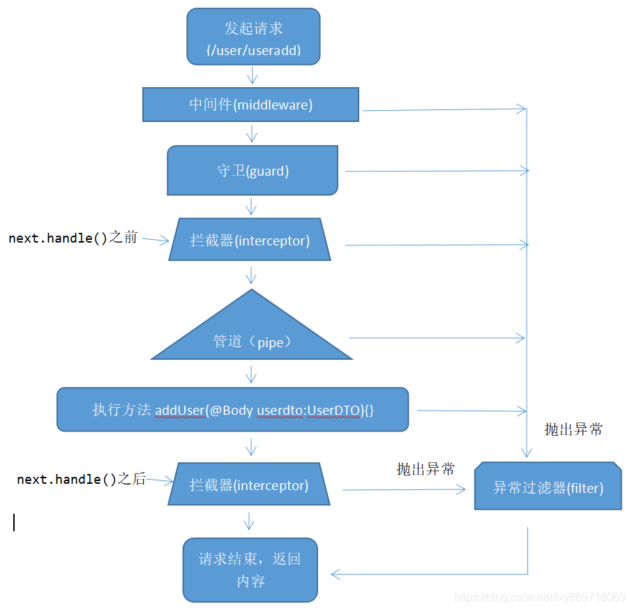

### 2.管道

在 Nestjs 中管道是具有 `@Injectable()` 装饰器且已实现 `PipeTransform` 接口的类。

管道有两个典型的应用场景:

`转换`：管道将输入数据转换为所需的数据输出(例如，将字符串转换为整数)
`验证`：对输入数据进行验证，如果验证成功继续传递; 验证失败则抛出异常

在这两种情况下, 管道 `参数(arguments)` 会由 控制器(`controllers`)的路由处理程序 进行处理。Nest 会在调用这个方法之前插入一个管道，管道会先拦截方法的调用参数,进行转换或是验证处理，然后用转换好或是验证好的参数调用原方法。

Nest 自带很多开箱即用的内置管道。你还可以构建自定义管道。

### 3.内置管道

`Nest` 自带九个开箱即用的管道，即

`ValidationPipe`
`ParseIntPipe`
`ParseFloatPipe`
`ParseBoolPipe`
`ParseArrayPipe`
`ParseUUIDPipe`
`ParseEnumPipe`
`DefaultValuePipe`
`ParseFilePipe`

他们从 `@nestjs/common` 包中导出

#### 案例 1：实现一个 ParseIntPipe

##### 1.创建一个 CRUD 模板

```

如果希望创建到src/modules目录下

使用 nest-cli.json 自定义源目录

{
  "sourceRoot": "src/modules"
}

nest g res list

这样就能生成到src/modules目录下了
```

##### 2. list 的 controller.ts 中实现一个接口

```
import { Controller, Get, Post, Body, Patch, Param, Delete } from '@nestjs/common';
import { ListService } from './list.service';
@Controller('list')
export class ListController {
  constructor(private readonly listService: ListService) { }
  @Get(':id')
  findOne(@Param('id') id: string) {
    console.log("id", id, typeof id);  // 1 string

    return this.listService.findOne(+id);
  }

}

```

如果我们希望将 id 转成数字类型 ，可以使用管道的 ParseIntPipe

```
import { Controller, Get, Post, Body, Patch, Param, Delete, ParseIntPipe } from '@nestjs/common';
import { ListService } from './list.service';
@Controller('list')
export class ListController {
  constructor(private readonly listService: ListService) { }
  @Get(':id')
  findOne(@Param('id', ParseIntPipe) id: number) {
    console.log("id", id, typeof id); // 1 number
    return this.listService.findOne(+id);
  }
}

```

#### 案例 2:验证 UUID

##### 1.安装 uuid

```
npm install uuid -S

npm install @types/uuid -D
```

##### 2.生成一个 uuid

```
import { Controller, Get, Post, Body, Patch, Param, Delete, ParseIntPipe, ParseUUIDPipe } from '@nestjs/common';
import { ListService } from './list.service';
@Controller('list')
export class ListController {
  constructor(private readonly listService: ListService) { }
  // 案例2 ParseUUIDPipe
  @Get(':id')
  findOne(@Param('id', ParseUUIDPipe) id: string) {
    console.log("id", id, typeof id); //d485e074-e0f6-48ab-8ae1-51c11a8c1034 string
    return this.listService.findOne(+id);
  }
}

```

当发 http 请求 http://localhost:3000/api/list/d485e074-e0f6-48ab-8ae1-51c11a8c1034 能够走通
当发 http 请求 http://localhost:3000/api/list/1 就会走异常过滤器逻辑

#### 案例 3:默认值

`Parse* 管道`期望参数值是被定义的。当接收到 `null` 或者 `undefined` 值时，它们会抛出异常。
为了允许端点处理丢失的查询字符串参数值，我们必须在 `Parse* 管道`对这些值进行操作之前注入默认值。DefaultValuePipe 提供了这种能力。
只需在相关 `Parse* 管道`之前的 `@Query()` 装饰器中实例化 `DefaultValuePipe`，如下所示：

```
import { Controller, Get, Query, Post, Body, Patch, Param, Delete, ParseFloatPipe, ParseIntPipe, ParseUUIDPipe, ParseBoolPipe, DefaultValuePipe } from '@nestjs/common';
import { ListService } from './list.service';

@Controller('list')
export class ListController {
  constructor(private readonly listService: ListService) { }

  // 访问 http://localhost:3000/list?flag=true&page=1
  @Get()
  findAll(
    @Query("flag", new DefaultValuePipe(false), ParseBoolPipe) flag: boolean,
    @Query("page", new DefaultValuePipe(0), ParseIntPipe) page: number,
  ) {

    console.log('flag', flag, page);

    return this.listService.findAll();
  }
}
```

当我们访问 http://localhost:3000/list?flag=true&page=1 的时候，不会报错
当我们访问 http://localhost:3000/list?flag=true，端点处理丢失的查询字符串参数值的情况下，默认会报错，new DefaultValuePipe()后就会默认带上默认值，从而不报错

### 4.自定义管道

先从一个简单的 ValidationPipe 开始

validation.pipe.ts:

```
import { PipeTransform, Injectable, ArgumentMetadata } from '@nestjs/common';

@Injectable()
export class ValidationPipe implements PipeTransform {
  transform(value: any, metadata: ArgumentMetadata) {
    return value;
  }
}

```

为实现 `PipeTransfrom`，每个管道必须声明 `transfrom()` 方法。该方法有两个参数：

`value`
`metadata`
`value` 参数是当前处理的方法参数(在被路由处理程序方法接收之前)，
`metadata` 是当前处理的方法参数的元数据。元数据对象具有以下属性：

```
export interface ArgumentMetadata {
  type: 'body' | 'query' | 'param' | 'custom';
  metatype?: Type<unknown>;
  data?: string;
}

```

#### 案例 4：管道验证 DTO

##### 1.前言

让我们把验证管道变得更有用一点。仔细看看 CatsController 的 create() 方法，我们希望在该方法被调用之前，请求主体(post body)得到验证。

```
@Post()
async create(@Body() createCatDto: CreateCatDto) {
  this.catsService.create(createCatDto);
}

```

注意到请求体参数为 createCatDto，其类型为 CreateCatDto :
create-cat.dto.ts

```
export class CreateCatDto {
  name: string;
  age: number;
  breed: string;
}

```

我们希望任何被该方法接收的请求主体都是有效的，因此我们必须验证 createCatDto 对象的三个成员。我们可以在路由处理程序方法中执行此操作，但这样做并不理想，因为它会破坏`单一职责原则` (single responsibility rule, SRP)。

另一种做法是创建一个验证类，把验证逻辑放在验证类中。这样做的缺点是我们必须要记得在每个该方法的前面，都调用一次验证类。

那么写一个验证中间件呢？可以，但做不到创建一个能在整个应用程序上下文中使用的通用中间件。因为中间件不知道`执行上下文`(execution context)，包括将被调用的处理程序及其任何参数。

管道就是为了处理这种应用场景而设计的。让我们继续完善我们的验证管道。

##### 2.先创建一个 pipe 验证管道

src/common/pipes/validation.pipe.ts:

```
nest g pi validation
然后移动到conmmon目录下的pipes目录下
```

```
import { PipeTransform, ArgumentMetadata } from "@nestjs/common"

export class ValidationPipe implements PipeTransform {
    transform(value: any, metadata: ArgumentMetadata) {
        return value;
    }

}
其中 value 就是DTO类型对象
```

##### 3.安装验证器

Nest 与  [class-validator](https://github.com/typestack/class-validator)  配合得很好。这个优秀的库允许您使用基于装饰器的验证。装饰器的功能非常强大，尤其是与 Nest 的  **Pipe**  功能相结合使用时，因为我们可以通过访问  `metatype`  信息做很多事情，在开始之前需要安装一些依赖。

```
 npm i --save class-validator class-transformer
```

validation.pipe.ts:

```
import { PipeTransform, ArgumentMetadata, BadRequestException } from "@nestjs/common"
import { plainToInstance } from "class-transformer";
import { validate } from "class-validator";
// 手写一个 ValidationPipe
export class ValidationPipe implements PipeTransform {
    async transform(value: any, metadata: ArgumentMetadata) {
        if (!metadata.metatype || !this.toValidate(metadata.metatype)) {
            return value;
        }
        // 它的作用是将普通的 JavaScript 对象转换为特定类的实例（就是 DTO 类的实例）。
        // 尽管 value 可能看起来已经是 DTO 对象，但实际上它只是一个普通的对象，没有任何与 DTO 类相关的方法或验证规则。
        // 确保传入的数据被转换为特定类的实例，从而支持类验证和类型安全。
        const DTO = plainToInstance(metadata.metatype, value);
        console.log('value', value, "DTO", DTO);
        // 通过 validate 验证 DTO 返回一个promise 的错误信息 如果有错误抛出
        const errors = await validate(DTO);  //错误的arr
        console.log("errors", errors);

        if (errors.length > 0) {
            throw new BadRequestException('Validation failed');
        }
        return value;
    }
    private toValidate(metatype: Function): boolean {
        const types: Function[] = [String, Boolean, Number, Array, Object];
        return !types.includes(metatype);
    }
}


```

list.controller.ts:

```

  // 自定义管道验证DTO
  @Post()
  create(@Body(ValidationPipe) createListDto: CreateListDto) {
    console.log("createListDto", createListDto);
    return this.listService.create(createListDto);
  }
```

也可以全局设置：

main.ts:

```
import { ValidationPipe } from "@nestjs/common";

  // 全局ValidationPipe管道
  app.useGlobalPipes(new ValidationPipe())
```

## 16. nestjs 守卫

### 定义

守卫是一个使用 `@Injectable() `装饰器的类。 守卫应该实现 `CanActivate `接口。

守卫有一个单独的责任。它们根据运行时出现的某些条件（例如权限，角色，访问控制列表等）来确定给定的请求是否由路由处理程序处理。这通常称为授权。在传统的  `Express`  应用程序中，通常由中间件处理授权(以及认证)。中间件是身份验证的良好选择，因为诸如  `token`  验证或添加属性到  `request`  对象上与特定路由(及其元数据)没有强关联。

中间件不知道调用  `next()`  函数后会执行哪个处理程序。另一方面，守卫可以访问  `ExecutionContext`  实例，因此确切地知道接下来要执行什么。它们的设计与异常过滤器、管道和拦截器非常相似，目的是让您在请求/响应周期的正确位置插入处理逻辑，并以声明的方式进行插入。这有助于保持代码的简洁和声明性。

### 创建一个守卫

```
nest g gu [name]
```

roles.guard.ts

```
import { Injectable, CanActivate, ExecutionContext } from '@nestjs/common';
import { Observable } from 'rxjs';

@Injectable()
export class RolesGuard implements CanActivate {
    canActivate(context: ExecutionContext): boolean | Promise<boolean> | Observable<boolean> {
        console.log("经过了守卫");
        return true
    }
}
```

### Controller 使用守卫

roles.controller.ts

```
import { Controller, Get, Post, Body, Patch, Param, Delete, UseGuards, SetMetadata } from '@nestjs/common';
import { RolesService } from './roles.service';
import { CreateRoleDto } from './dto/create-role.dto';
import { UpdateRoleDto } from './dto/update-role.dto';
import { RolesGuard } from '../../common/guards/roles.guard';
import { Roles } from '../../common/decorators/roles.decorator';


@Controller('roles')
@UseGuards(RolesGuard)
export class RolesController {
  constructor(private readonly rolesService: RolesService) { }


  // 一个简单例子
  @Get()
  // 不推荐直接这样写，建议应该创建你自己的装饰器。
  // @SetMetadata('roles', ['admin']) //roles是前端key , ['admin'] 是一个特定的值 ，附加到 findAll() 方法

  @Roles('admin')
  findAll() {
    return this.rolesService.findAll();
  }

}

```

### 全局守卫

```
app.useGlobalGuards(new RoleGuard())
```

### 针对角色控制守卫

`SetMetadata` 装饰器

第一个参数为 `key`，第二个参数自定义我们的例子是数组存放的权限

#### 封装自定义装饰器

```

import { SetMetadata } from '@nestjs/common';

export const Roles = (...roles: string[]) => SetMetadata('roles', roles); //roles是前端key , ['admin'] 是一个特定的值 ，附加到 findAll() 方法

```

roles.controller.ts:

```
import { Controller, Get, Post, Body, Patch, Param, Delete, UseGuards, SetMetadata } from '@nestjs/common';
import { RolesService } from './roles.service';
import { CreateRoleDto } from './dto/create-role.dto';
import { UpdateRoleDto } from './dto/update-role.dto';
import { RolesGuard } from '../../common/guards/roles.guard';
import { Roles } from '../../common/decorators/roles.decorator';


@Controller('roles')
@UseGuards(RolesGuard)
export class RolesController {
  constructor(private readonly rolesService: RolesService) { }


  // 一个简单例子
  @Get()
  // 不推荐直接这样写，建议应该创建你自己的装饰器。
  // @SetMetadata('roles', ['admin']) //roles是前端key , ['admin'] 是一个特定的值 ，附加到 findAll() 方法

  @Roles('admin')
  findAll() {
    return this.rolesService.findAll();
  }

}

```

guard 使用 `Reflector` 反射读取 `setMetaData` 的值 去做判断这边例子是从 url 判断有没有 admin 权限

roles.guard.ts：

```

import { Injectable, CanActivate, ExecutionContext } from '@nestjs/common'
import { Observable } from 'rxjs'
import { Reflector } from '@nestjs/core'

import type { Request } from 'express'
@Injectable()
export class RolesGuard implements CanActivate {
  // 注入依赖  为了访问路由的角色(自定义元数据)，我们将使用在 @nestjs/core 中提供的 Reflector 帮助类。
  constructor(private reflector: Reflector) {}
  canActivate(context: ExecutionContext): boolean | Promise<boolean> | Observable<boolean> {
    console.log('经过了守卫', context)

    const roles = this.reflector.get<string[]>('roles', context.getHandler()) //与key对应
    if (!roles) {
      return true
    }

    const request = context.switchToHttp().getRequest<Request>()
    if (roles.includes(request.query.role as string)) {
      return true
    } else {
      return false
    }
  }
}

```

当访问 http://localhost:3000/user?role=admin 时，会打印出经过了守卫，然后返回 true

## 17.自定义装饰器

`Nest` 是基于**装饰器**这种语言特性而创建的。在很多常见的编程语言中，装饰器是一个广为人知的概念，但在 `JavaScript` 世界中，这个概念仍然相对较新。所以为了更好地理解装饰器是如何工作的，你应该看看 [这篇](https://medium.com/google-developers/exploring-es7-decorators-76ecb65fb841) 文章。下面给出一个简单的定义：

`ES2016` 装饰器是一个表达式，它返回一个可以将目标、名称和属性描述符作为参数的函数。通过在装饰器前面添加一个 `@` 字符并将其放置在你要装饰的内容的最顶部来应用它。可以为类、方法或属性定义装饰器。

### 1.实现一个@Query 自定义装饰器

本质上 装饰器是一个函数

#### 前端 list 实体

```

list：
{
   name："keven",
   age:18
}
```

在 `Node.js` 中，会经常将需要传递的值加到请求对象的属性中。然后在每个路由处理程序中手动提取它们，使用如下代码：

```
  @Get()
  find(@Req() req) {
   console.log(req.list：)
   return true
  }
```

```
const user = req.user;
```

#### 创建一个 list.decorator.ts 文件

```
import { createParamDecorator, ExecutionContext } from '@nestjs/common'

export const List = createParamDecorator((data: unknown, ctx: ExecutionContext) => {
  const request = ctx.switchToHttp().getRequest()
  return request.user
})

```

#### 在 controller 中使用

现在你可以在任何你想要的地方很方便地使用它。

```
@Get()
find(@List() list: ListEntity) {
  console.log(list);
}
```

本质上就是实现一个@Query

### 2.实现一个类似@Query()传参的装饰器

```
import { createParamDecorator, ExecutionContext } from '@nestjs/common'

export const List = createParamDecorator((data: string, ctx: ExecutionContext) => {
  const request = ctx.switchToHttp().getRequest()
  //   return request.list

  const list = request.list

  return data ? list && list[data] : list
})

```

然后，您可以通过控制器中的 @List() 装饰器访问以下特定属性：

```
@Get()
 find(@List('name') name: string) {
  console.log(`Hello ${name}`);
}

```

### 3.使用管道

`Nest` 对待自定义的路由参数装饰器和自身内置的装饰器（`@Body()`，`@Param()` 和 `@Query()`）一样。这意味着管道也会因为自定义注释参数（在本例中为 `user` 参数）而被执行。此外，你还可以直接将管道应用到自定义装饰器上：

```
@Get()
async findOne(@User(new ValidationPipe()) user: UserEntity) {
  console.log(user);
}Copy to clipboardErrorCopied
```

> 请注意，`validateCustomDecorators` 选项必须设置为 `true`。默认情况下，`ValidationPipe` 不验证使用自定义装饰器注释的参数。

### 4.装饰器聚合

`Nest` 提供了一种辅助方法来聚合多个装饰器。例如，假设您要将与身份验证相关的所有装饰器聚合到一个装饰器中。这可以通过以下方法实现：

```
import { applyDecorators } from '@nestjs/common';

export function Auth(...roles: Role[]) {
  return applyDecorators(
    SetMetadata('roles', roles),
    UseGuards(AuthGuard, RolesGuard),
    ApiBearerAuth(),
    ApiUnauthorizedResponse({ description: 'Unauthorized"' })
  );
}Copy to clipboardErrorCopied
```

然后，你可以参照以下方式使用 `@Auth()` 自定义装饰器：

```
@Get('users')
@Auth('admin')
findAllUsers() {}Copy to clipboardErrorCopied
```

这具有通过一个声明应用所有四个装饰器的效果。

> 来自 `@nestjs/swagger` 依赖中的 `@ApiHideProperty()` 装饰器无法聚合，因此此装饰器无法正常使用 `applyDecorators` 方法。

## 18. nestjs swagger 接口文档

[OpenAPI](https://swagger.io/specification/)(Swagger)规范是一种用于描述  `RESTful API`  的强大定义格式。 `Nest`  提供了一个专用[模块](https://github.com/nestjs/swagger)来使用它。

### [安装](https://docs.nestjs.cn/10/recipes?id=%e5%ae%89%e8%a3%85-4)

首先，您必须安装所需的包：

```
pnpm install --save @nestjs/swagger swagger-ui-expressCopy to clipboardErrorCopied
```

如果你正在使用 `fastify` ，你必须安装 `fastify-swagger` 而不是 `swagger-ui-express` ：

```
pnpm install --save @nestjs/swagger fastify-swagger
```

main.ts

```

// swagger
import { DocumentBuilder, SwaggerModule } from "@nestjs/swagger";


  // swagger
  const options = new DocumentBuilder()
    .setTitle('API example')
    .setDescription("api接口集合")
    .setVersion("1.0")
    .build()

  const document = SwaggerModule.createDocument(app, options, {
    ignoreGlobalPrefix: false //不忽略通过 setGlobalPrefix() 设置的路由的全局前缀
  })

  SwaggerModule.setup('/api-docs', app, document);  //  localhost:3000/api 访问
```

生成并下载 Swagger JSON 文件，只需在浏览器中导航到  `http://localhost:3000/api-docs-json` （如果您的 Swagger 文档是在  `http://localhost:3000/api-docs`  下）。 也可以将 json 导入到 apifox 中。

### ApiTags - 路由分组

使用`@ApiTags` 给每个 controller 添加分组

比如 list.controller.ts

```
import { ApiTags } from "@nestjs/swagger";

@Controller('list')
@ApiTags("list")
export class ListController {
   ....
}
```

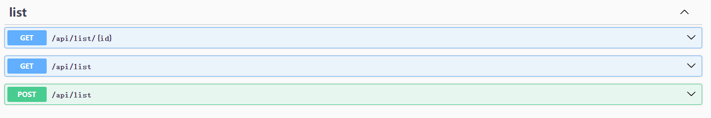

### ApiOperation 接口描述

list.controller.ts:

```
  @Get(':id')
  @ApiOperation({ summary: '获取列表', description: '这是一个获取id为xxx的列表' })
  findOne(@Param('id', ParseUUIDPipe) id: string) {
    console.log("id", id, typeof id); //d485e074-e0f6-48ab-8ae1-51c11a8c1034 string
    return this.listService.findOne(+id);
  }
```

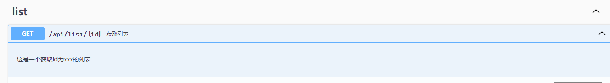

### ApiParam 动态参数描述

list.controller.ts:

```
  @Get(':id')
  @ApiOperation({ summary: '获取列表', description: '这是一个获取id为xxx的列表' })
  @ApiParam({ name: 'id', description: '列表id', type: 'string', example: "1" })

  findOne(@Param('id', ParseUUIDPipe) id: string) {
    console.log("id", id, typeof id); //d485e074-e0f6-48ab-8ae1-51c11a8c1034 string
    return this.listService.findOne(+id);
  }
```

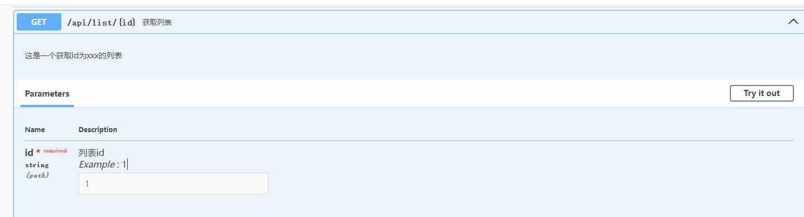

### ApiQuery 修饰 get

list.controller.ts:

```
  @Get()
  @ApiQuery({ name: 'flag', description: '开关阈值', type: 'boolean', example: true, required: true })
  @ApiQuery({ name: 'page', description: '页数', type: 'number', example: 10, required: true })
  findAll(
    @Query("flag", new DefaultValuePipe(false), ParseBoolPipe) flag: boolean,
    @Query("page", new DefaultValuePipe(0), ParseIntPipe) page: number,
  ) {

    console.log('flag', flag, page);

    return this.listService.findAll();
  }

```

### ApiProperty -POST - DTO 参数

```
import { ApiProperty } from "@nestjs/swagger";
export class CreateListDto {
   @ApiProperty({ description: '姓名', example: "Bob" })
    name: string;

   @ApiProperty({ description: '年龄', example: 18 })
    age: number;
}

```

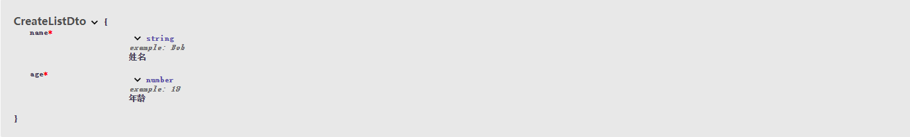
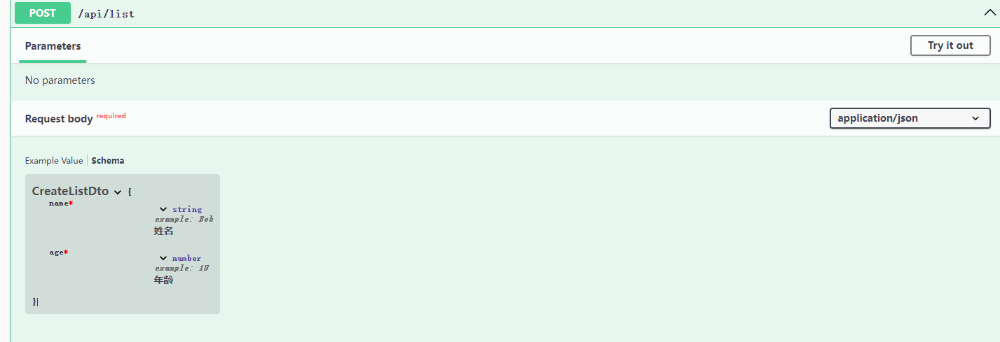

### ApiResponse 自定义返回信息

```
@ApiResponse({status:403,description:"自定义返回信息"})
```

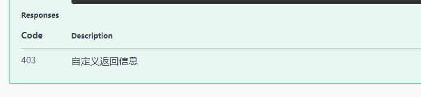

与异常过滤器部分中定义的常见 `HTTP` 异常相同，Nest 还提供了一组可重用的 **API 响应** ，这些响应继承自核心 `@ApiResponse` 装饰器：

- `@ApiOkResponse()`
- `@ApiCreatedResponse()`
- `@ApiBadRequestResponse()`
- `@ApiUnauthorizedResponse()`
- `@ApiNotFoundResponse()`
- `@ApiForbiddenResponse()`
- `@ApiMethodNotAllowedResponse()`
- `@ApiNotAcceptableResponse()`
- `@ApiRequestTimeoutResponse()`
- `@ApiConflictResponse()`
- `@ApiGoneResponse()`
- `@ApiPayloadTooLargeResponse()`
- `@ApiUnsupportedMediaTypeResponse()`
- `@ApiUnprocessableEntityResponse()`
- `@ApiInternalServerErrorResponse()`
- `@ApiNotImplementedResponse()`
- `@ApiBadGatewayResponse()`
- `@ApiServiceUnavailableResponse()`
- `@ApiGatewayTimeoutResponse()`
- `@ApiDefaultResponse()`

```
@Post()
@ApiCreatedResponse({ description: 'The record has been successfully created.'})
@ApiForbiddenResponse({ description: 'Forbidden.'})
async create(@Body() createCatDto: CreateCatDto) {
  this.catsService.create(createCatDto);
}Copy to clipboardErrorCopied
```

要为请求指定返回模型，必须创建一个类并使用 `@ApiProperty()` 装饰器注释所有属性。

```
export class Cat {
  @ApiProperty()
  id: number;

  @ApiProperty()
  name: string;

  @ApiProperty()
  age: number;

  @ApiProperty()
  breed: string;
}Copy to clipboardErrorCopied
```

之后，必须将 `Cat` 模型与响应装饰器的 `type` 属性结合使用。

```
@ApiTags('cats')
@Controller('cats')
export class CatsController {
  @Post()
  @ApiCreatedResponse({
    description: 'The record has been successfully created.',
    type: Cat
  })
  async create(@Body() createCatDto: CreateCatDto): Promise<Cat> {
    return this.catsService.create(createCatDto);
  }
}
```

### ApiHeader HTTP 头字段

list.controller.ts

```
@Controller('list')
@ApiTags("list")
@ApiHeader({
  name: 'Authorization',
  description: 'Auth token'
})
export class ListController { ...}
```

### ApiSecurity 安全性机制

#### 安全

要定义针对特定操作应使用的安全性机制，请使用 `@ApiSecurity()` 装饰器。

```
@ApiSecurity('basic')
@Controller('list')
export class ListController {}
```

在运行应用程序之前，请记住使用 `DocumentBuilder` 将安全性定义添加到您的基本文档中：

```
const options = new DocumentBuilder().addSecurity('basic', {
  type: 'http',
  scheme: 'basic'
});
```

一些最流行的身份验证技术是预定义的（例如 `basic` 和 `bearer`），因此，您不必如上所述手动定义安全性机制。

#### bssic 身份验证技术

简化：
使用 @ApiBasicAuth()。

```

@ApiBasicAuth()
@Controller('list')
export class ListController {}


在运行应用程序之前，请记住使用 DocumentBuilder 将安全性定义添加到基本文档中：

const options = new DocumentBuilder().addBasicAuth();
```

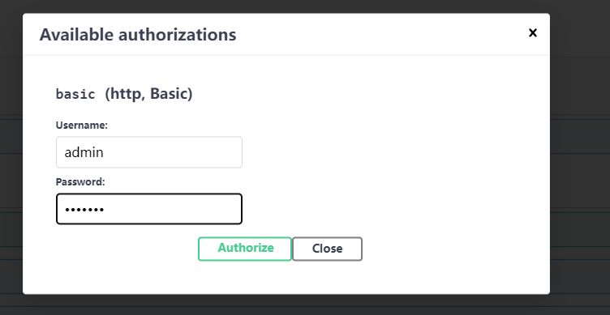

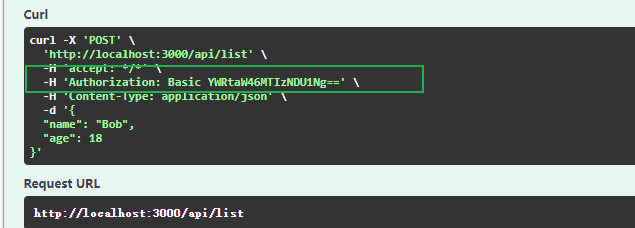

#### Bearer 身份验证技术

为了使用 bearer 认证， 使用  `@ApiBearerAuth()`。

```
@ApiBearerAuth()
@Controller('list')
export class ListController {}
```

在运行应用程序之前，请记住使用 `DocumentBuilder` 将安全性定义添加到基本文档中：

```
const options = new DocumentBuilder().addBearerAuth();
```


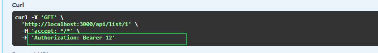

#### [Cookie 认证](https://docs.nestjs.cn/10/recipes?id=cookie-%e8%ae%a4%e8%af%81)

使用`@ApiCookieAuth()`来使能 cookie 认证。

```
@ApiCookieAuth()
@Controller('cats')
export class CatsController {}
```

在你运行应用前，记得使用`DocumentBuilder`来向你的基础文档添加安全定义。

```
const options = new DocumentBuilder().addCookieAuth('optional-session-id');
```

### ApiConsumes 文件上传

可以使用  `@ApiBody`  装饰器和  `@ApiConsumes()`  为特定方法启用文件上载。 这里是使用[文件上传](https://docs.nestjs.com/techniques/file-upload)技术的完整示例：

upload.controller.ts:

```
// UseInterceptors, UploadedFile
import { Controller, Get, Post, UseInterceptors, UploadedFile } from '@nestjs/common'
import { UploadService } from './upload.service'
//
import { FileInterceptor } from '@nestjs/platform-express'
import { ApiTags, ApiConsumes, ApiBody } from "@nestjs/swagger";
import { FileUploadDto } from './dto/file.dto';


@Controller('upload')
@ApiTags("upload")
export class UploadController {
  constructor(private readonly uploadService: UploadService) { }

  // upload/album
  @Post('album')
  @UseInterceptors(FileInterceptor('file')) //与前端接口中字段匹配

  @ApiConsumes('multipart/form-data')
  @ApiBody({
    description: '单个图片上传',
    type: FileUploadDto,
  })
  uploadFile(@UploadedFile() file: FileUploadDto) {
    //@UploadedFile()  装饰器从  request  中取出  file
    console.log(file)

    return {
      code: 200,
      data: file,
    }
  }
}

```

FileUploadDto 如下所定义：

```

import { ApiProperty } from "@nestjs/swagger";

export class FileUploadDto {
    @ApiProperty({ type: 'string', format: 'binary' })
    file: Express.Multer.File;
}
```

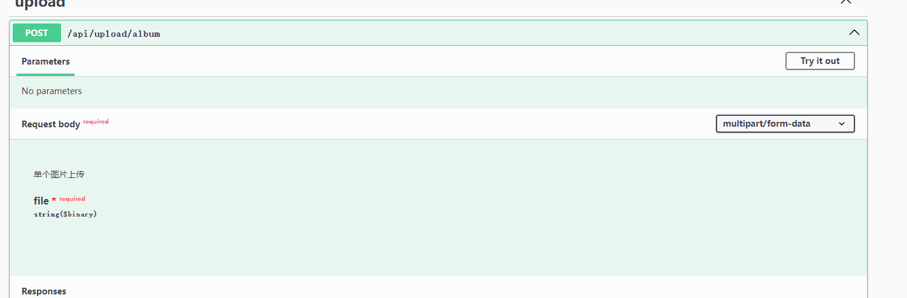

### 其他装饰器

所有可用的 OpenAPI 装饰器都有一个 `Api` 前缀，可以清楚地区分核心装饰器。 以下是导出的装饰器的完整列表，以及可以应用装饰器的级别的名称。

|                          |                     |
| ------------------------ | ------------------- |
| `@ApiOperation()`        | Method              |
| `@ApiResponse()`         | Method / Controller |
| `@ApiProduces()`         | Method / Controller |
| `@ApiConsumes()`         | Method / Controller |
| `@ApiBearerAuth()`       | Method / Controller |
| `@ApiOAuth2()`           | Method / Controller |
| `@ApiBasicAuth()`        | Method / Controller |
| `@ApiSecurity()`         | Method / Controller |
| `@ApiExtraModels()`      | Method / Controller |
| `@ApiBody()`             | Method              |
| `@ApiParam()`            | Method              |
| `@ApiQuery()`            | Method              |
| `@ApiHeader()`           | Method / Controller |
| `@ApiExcludeEndpoint()`  | Method              |
| `@ApiTags()`             | Method / Controller |
| `@ApiProperty()`         | Model               |
| `@ApiPropertyOptional()` | Model               |
| `@ApiHideProperty()`     | Model               |
| `@ApiExtension()`        | Model               |

### [插件](https://docs.nestjs.cn/10/recipes?id=%e6%8f%92%e4%bb%b6)

TypeScript 的元数据反射系统具有几个限制，这些限制使得例如无法确定类包含哪些属性或无法识别给定属性是可选属性还是必需属性。但是，其中一些限制可以在编译时解决。 Nest 提供了一个插件，可以增强 TypeScript 编译过程，以减少所需的样板代码量。

该插件是**选择性**的。可以手动声明所有装饰器，也可以只声明需要的特定装饰器。

Swagger 插件会自动：

- 除非使用 `@ApiHideProperty`，否则用 `@ApiProperty` 注释所有 DTO 属性
- 根据问号标记设置 `required` 属性（例如，`name?: string` 将设置 `required: false`）
- 根据类型设置 `type` 或 `enum` 属性（也支持数组）
- 根据分配的默认值设置 `default` 属性
- 根据 `class-validator` 装饰器设置多个验证规则（如果 `classValidatorShim` 设置为 `true`）
- 向具有正确状态和 `type`（响应模型）的每个端点添加响应装饰器

请注意，你的文件名必须包含如下前缀之一：[‘.dto.ts’, ‘.entity.ts’] (例如, create-user.dto.ts) 从而能让插件对其进行分析。

以前，如果您想通过 Swagger UI 提供交互式体验，您必须重复很多代码，以使程序包知道应如何在规范中声明您的模型/组件。例如，您可以定义一个简单的 `CreateUserDto` 类，如下所示：

```
export class CreateUserDto {
  @ApiProperty()
  email: string;

  @ApiProperty()
  password: string;

  @ApiProperty({ enum: RoleEnum, default: [], isArray: true })
  roles: RoleEnum[] = [];

  @ApiProperty({ required: false, default: true })
  isEnabled?: boolean = true;
}Copy to clipboardErrorCopied
```

尽管对于中型项目而言这并不是什么大问题，但是一旦您拥有大量的类，它就会变得冗长而笨拙。

现在，在启用 Swagger 插件的情况下，可以简单地声明上述类定义：

```
export class CreateUserDto {
  email: string;
  password: string;
  roles: RoleEnum[] = [];
  isEnabled?: boolean = true;
}Copy to clipboardErrorCopied
```

该插件会基于**抽象语法树**动态添加适当的装饰器。因此，您不必再为分散在整个项目中的 `@ApiProperty` 装饰器而苦恼。

启用该插件，只需打开 `nest-cli.json`（如果使用[Nest CLI](https://docs.nestjs.cn/cli/overview)) 并添加以下`plugins`配置：

```
{
  "collection": "@nestjs/schematics",
  "sourceRoot": "src",
  "compilerOptions": {
    "plugins": ["@nestjs/swagger/plugin"]
  }
}Copy to clipboardErrorCopied
```

您可以使用 `options` 属性来自定义插件的行为。

```
"plugins": [
  {
    "name": "@nestjs/swagger/plugin",
    "options": {
      "classValidatorShim": false
    }
  }
]Copy to clipboardErrorCopied
```

`options` 属性必须满足以下接口：

```
export interface PluginOptions {
  dtoFileNameSuffix?: string[];
  controllerFileNameSuffix?: string[];
  classValidatorShim?: boolean;
}
```

| 选项(Option)               | 默认(Default)               | 描述(Description)                                                                                                |
| -------------------------- | --------------------------- | ---------------------------------------------------------------------------------------------------------------- |
| `dtoFileNameSuffix`        | `['.dto.ts', '.entity.ts']` | DTO（数据传输对象）文件后缀                                                                                      |
| `controllerFileNameSuffix` | `.controller.ts`            | 控制器文件后缀                                                                                                   |
| `classValidatorShim`       | `true`                      | 如果设置为 true，则模块将重用 `class-validator` 验证装饰器 (例如 `@Max(10)` 会将 `max: 10` 添加到 schema 定义中) |

## 19 nestjs 连接数据库 && TypeORM

`Nestjs` 集成数据库，由于企业用的`Mysql` 居多 我们就用`Nestjs` 连接 `Mysql`

### 1.安装 mysql navicat

https://blog.csdn.net/m0_52559040/article/details/121843945

docker

```sh
docker search mysql
docker pull mysql:latest
docker run -e MYSQL_ROOT_PASSWORD=123456 -p 3306:3306 -d mysql:8

```

navicat 16

https://www.cnblogs.com/ZJ-CN/p/17600684.html

### 2.ORM 框架（typeOrm）

常用的 ORM 框架有：`typeorm` `primsa`

#### 2.1 typeorm

安装依赖

```sh
pnpm install --save @nestjs/typeorm typeorm mysql2
```

创建一张 数据库 test

```
-- Active: 1724985214942@@127.0.0.1@3306
   CREATE DATABASE
   DEFAULT CHARACTER SET = 'utf8mb4';
```

在 app.module.ts 注册

```
import { Module } from '@nestjs/common'
import { AppController } from './app.controller'
import { AppService } from './app.service'
import { UserController } from './modules/user/user.controller'
import { UserModule } from './modules/user/user.module'
import { User2Module } from './modules/user2/user2.module'
import { DocModule } from './modules/doc/doc.module'
import { UploadModule } from './modules/upload/upload.module'
import { ListModule } from './modules/list/list.module';
import { RolesModule } from './modules/roles/roles.module';

import { TypeOrmModule } from '@nestjs/typeorm';


@Module({
  imports: [
    TypeOrmModule.forRoot({
      type: "mysql", //数据库类型
      username: "root", //账号
      password: "123456", //密码
      host: "localhost", //host
      port: 3306, //
      database: "test", //库名
      entities: [__dirname + '/**/*.entity{.ts,.js}'], //实体文件
      synchronize: true, //synchronize字段代表是否自动将实体类同步到数据库
      retryDelay: 500, //重试连接数据库间隔
      retryAttempts: 10,//重试连接数据库的次数
      autoLoadEntities: true, //如果为true,将自动加载实体 forFeature()方法注册的每个实体都将自动添加到配置对象的实体数组中
    }),

    UserModule,
    User2Module,
    DocModule,
    UploadModule,
    ListModule,
    RolesModule


  ],
  controllers: [AppController, UserController],
  providers: [AppService],
})
export class AppModule { }

```

以 auth 为例 ，定义 auth.entity.ts 实体 ,并在 auth.module.ts 中注册

auth.entity.ts:

```
import { Entity, PrimaryGeneratedColumn, Column, CreateDateColumn } from 'typeorm'

@Entity()
export class Auth {
    @PrimaryGeneratedColumn('uuid')
    id: string

    @Column()
    token: string

    @CreateDateColumn()
    createdTime: Date
}
```

auth.module.ts:

```
import { Module } from '@nestjs/common';
import { AuthService } from './auth.service';
import { AuthController } from './auth.controller';
import { TypeOrmModule } from '@nestjs/typeorm';
import { Auth } from './entities/auth.entity';

@Module({
  imports: [TypeOrmModule.forFeature([Auth])],
  controllers: [AuthController],
  providers: [AuthService],
})
export class AuthModule { }
```

这样就创建了数据库`test`,也可以看到`auth`表

## 20.nestjs 实体

### 1.定义

实体是一个映射到数据库·表的类。 你可以通过定义一个新类来创建一个实体，并用`@Entity()`来标记：

```
import {Entity,Column,PrimaryGeneratedColumn} from 'typeorm'

@Entity()
export class Test {
    @PrimaryGeneratedColumn()
    id:number

    @Column()
    name:string

    @Column()
    password:string

    @Column()
    age:number
}
```

### 2.列类型

```ts
    @Column({type:"varchar",length:200})
    password: string

    @Column({ type: "int"})
    age: number

    @CreateDateColumn({type:"timestamp"})
    create_time:Date
```

mysql 所有类型

`int`, `bigint`, `bit`, `decimal`, `money`, `numeric`, `smallint`, `smallmoney`, `tinyint`, `float`, `real`, `date`, `datetime2`, `datetime`, `datetimeoffset`, `smalldatetime`, `time`, `char`, `varchar`, `text`, `nchar`, `nvarchar`, `ntext`, `binary`, `image`, `varbinary`, `hierarchyid`, `sql_variant`, `timestamp`, `uniqueidentifier`, `xml`, `geometry`, `geography`, `rowversion`

#### 列选项

```
    @Column({
        type:"varchar",
        name:"ipaaa", //数据库表中的列名
        nullable:true, //在数据库中使列NULL或NOT NULL。 默认情况下，列是nullable：false
        comment:"注释",
        select:true,  //定义在进行查询时是否默认隐藏此列。 设置为false时，列数据不会显示标准查询。 默认情况下，列是select：true
        default:"xxxx", //加数据库级列的DEFAULT值
        primary:false, //将列标记为主要列。 使用方式和@ PrimaryColumn相同。
        update:true, //指示"save"操作是否更新列值。如果为false，则只能在第一次插入对象时编写该值。 默认值为"true"
        collation:"", //定义列排序规则。
    })
    ip:string
```

#### 自动生成列

```
@Generated('uuid')
uuid:string
```

#### 枚举列

```
  @Column({
    type:"enum",
    enum:['1','2','3','4'],
    default:'1'
  })
  xx:string
```

#### 主列

自动递增的主键

```
@PrimaryGeneratedColumn()
id:string
```

自动递增 uuid

```
@PrimaryGeneratedColumn("uuid")
id:string
```

#### simple-array 列类型

有一种称为 simple-array 的特殊列类型，它可以将原始数组值存储在单个字符串列中。 所有值都以逗号分隔

```
@Entity()
export class User {
    @PrimaryGeneratedColumn()
    id: number;

    @Column("simple-array")
    names: string[];
}
```

simple-json 列类型
还有一个名为 simple-json 的特殊列类型，它可以存储任何可以通过 JSON.stringify 存储在数据库中的值。 当你的数据库中没有 json 类型而你又想存储和加载对象，该类型就很有用了。 例如:

```
@Entity()
export class User {
    @PrimaryGeneratedColumn()
    id: number;

    @Column("simple-json")
    profile: { name: string; nickname: string };
}
```

## 21.nestjs 第一个 CURD

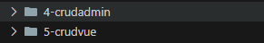

## 22.typeorm 多表联查

有时候，我们不会把所有数据放在一张表里，我们会进行分表，把数据分开存，然后通过关联关系，联合查询。

### 1.[关系](https://typeorm.bootcss.com/relations#%E4%BB%80%E4%B9%88%E6%98%AF%E5%85%B3%E7%B3%BB)

关系可以帮助你轻松地与相关实体合作。 有几种类型的关系：

- [一对一](https://typeorm.bootcss.com/one-to-one-relations) 使用 `@OneToOne`
- [多对一](https://typeorm.bootcss.com/many-to-one-one-to-many-relations) 使用 `@ManyToOne`
- [一对多](https://typeorm.bootcss.com/many-to-one-one-to-many-relations) 使用 `@OneToMany`
- [多对多](https://typeorm.bootcss.com/many-to-many-relations) 使用 `@ManyToMany`

### 2.[关系选项](https://typeorm.bootcss.com/relations#%E5%85%B3%E7%B3%BB%E9%80%89%E9%A1%B9)

你可以为关系指定几个选项：

- `eager: boolean` - 如果设置为 true，则在此实体上使用`find *` 或`QueryBuilder`时，将始终使用主实体加载关系
- `cascade: boolean` - 如果设置为 true，则将插入相关对象并在数据库中更新。
- `onDelete: "RESTRICT"|"CASCADE"|"SET NULL"` - 指定删除引用对象时外键的行为方式
- `primary: boolean` - 指示此关系的列是否为主列。
- `nullable: boolean` -指示此关系的列是否可为空。 默认情况下是可空。
- `orphanedRowAction: "nullify" | "delete"` - 将子行从其父行中删除后，确定该子行是孤立的（默认值）还是删除的。

### 3.[`@JoinColumn`选项](https://typeorm.bootcss.com/relations#joincolumn%E9%80%89%E9%A1%B9)

`@ JoinColumn`不仅定义了关系的哪一侧包含带有外键的连接列，还允许自定义连接列名和引用的列名。

当我们设置`@ JoinColumn`时，它会自动在数据库中创建一个名为`propertyName + referencedColumnName`的列。 例如：

```
@ManyToOne(type => Category)
@JoinColumn() // 这个装饰器对于@ManyToOne是可选的，但@OneToOne是必需的
category: Category;
```

此代码将在数据库中创建`categoryId`列。 如果要在数据库中更改此名称，可以指定自定义连接列名称：

```
@ManyToOne(type => Category)
@JoinColumn({ name: "cat_id" })
category: Category;
```

Join 列始终是对其他一些列的引用（使用外键）。 默认情况下，关系始终引用相关实体的主列。 如果要与相关实体的其他列创建关系 - 你也可以在`@ JoinColumn`中指定它们：

```
@ManyToOne(type => Category)
@JoinColumn({ referencedColumnName: "name" })
category: Category;
```

该关系现在引用`Category`实体的`name`，而不是`id`。 该关系的列名将变为`categoryName`

### 4.[`@JoinTable`选项](https://typeorm.bootcss.com/relations#jointable%E9%80%89%E9%A1%B9)

`@ JoinTable`用于“多对多”关系，并描述"junction"表的连接列。 联结表是由 TypeORM 自动创建的一个特殊的单独表，其中的列引用相关实体。 你可以使用`@ JoinColumn`更改联结表及其引用列中的列名： 你还可以更改生成的"junction"表的名称。

```
@ManyToMany(type => Category)
@JoinTable({
    name: "question_categories" // 此关系的联结表的表名
    joinColumn: {
        name: "question",
        referencedColumnName: "id"
    },
    inverseJoinColumn: {
        name: "category",
        referencedColumnName: "id"
    }
})
categories: Category[];
```

如果目标表具有复合主键， 则必须将一组属性发送到`@ JoinTable`。

### 5.一对一

在`	typeorm`中，`一对一关系`是一种数据库关系，其中一个表中的每一行只与另外一个表中的一行相关联，比如用户和身份证之间的关系

我们在 4-crudadmin 中，以`User表`和`Profile表`实体为例

#### 单向

```typescript
// user.entity
import {
  Entity,
  PrimaryGeneratedColumn,
  Column,
  CreateDateColumn,
  OneToOne,
  JoinColumn,
} from "typeorm";
import { Profile } from "./profile.entity";

@Entity()
export class User {
  @PrimaryGeneratedColumn("uuid")
  id: string;
  @Column({ type: "varchar" })
  name: string;
  @Column({ type: "varchar" })
  desc: string;
  @CreateDateColumn({ type: "timestamp" })
  createdTime: Date;

  // 一对一
  @JoinColumn() //必选项并且只能在关系的一侧设置。 你设置@JoinColumn的哪一方，哪一方的表将包含一个"relation id"和目标实体表的外键。
  @OneToOne(() => Profile, {
    cascade: true, // 级联操作,启用级联后，只需一次save调用即可保存此关系。
    onDelete: "CASCADE", // 删除user时，自动删除profile
    onUpdate: "CASCADE", // 更新user时，自动更新profile
  })
  profile: Profile;
}
```

```typescript
//profile.entity
import {
  Entity,
  PrimaryGeneratedColumn,
  Column,
  CreateDateColumn,
} from "typeorm";

@Entity()
export class Profile {
  @PrimaryGeneratedColumn("uuid")
  id: string;

  @Column({
    type: "bigint",
    comment: "身份证号",
  })
  code: number;

  @Column({
    type: "varchar",
    comment: "姓名",
  })
  name: string;
}
```

```typescript
//user.controller
  @Post('/oneToOneApi')
  oneToOneApi(@Body() oneToOneDto: OneToOneDto) {
    return this.userService.oneToOneApi(oneToOneDto)
  }
```

```typescript
// user.service
  async oneToOneApi(oneToOneApi: OneToOneDto) {
    const profile = new Profile()
    profile.name = oneToOneApi.name
    profile.code = oneToOneApi.code
    const userInfo = await this.userRepository.findOne({
      where: {
        id: oneToOneApi.id,
      },
    })
    userInfo.profile = profile
    console.log(userInfo.profile.code)

    // await this.profileRepository.save(profile)
    await this.userRepository.save(userInfo)
    return true
  }
```

关系可以是单向的和双向的。

#### 双向

```typescript
import {
  Entity,
  PrimaryGeneratedColumn,
  Column,
  CreateDateColumn,
  OneToOne,
} from "typeorm";
import { User } from "./user.entity";

@Entity()
export class Profile {
  @PrimaryGeneratedColumn("uuid")
  id: string;

  @Column({
    type: "bigint",
    comment: "身份证号",
  })
  code: number;

  @Column({
    type: "varchar",
    comment: "姓名",
  })
  name: string;

  @OneToOne(() => User, (user) => user.profile) // 将另一面指定为第二个参数
  user: User;
}
```

#### 查询一对一关系

```typescript
user.controller
  @Get('/getOneToOne')
  getOneToOne(@Query() query) {
    return this.userService.getOneToOne()
  }
```

```typescript
user.service
  async getOneToOne() {
    return this.userRepository.find({
      //查询的时候如果需要联合查询需要增加 relations
      relations: ['profile'],
    })
  }
```

```typescript
//访问http://localhost:3000/api/user/getOneToOne

[
  {
    id: "95bdc98c-a220-4348-834e-56692d446ebd",
    name: "成哥",
    desc: "很帅",
    createdTime: "2024-09-19T07:13:11.424Z",
    profile: {
      id: "9852ccad-8ce0-41ce-b9d9-1f668f7ae074",
      code: "3434",
      name: "成哥",
    },
  },
];
```

如果你希望反查也可以，借助双向关系

```typescript
  async getOneToOne() {
    return this.profileRepository.find({
      //查询的时候如果需要联合查询需要增加 relations
      relations: ['user'],
    })
  }


```

```typescript
//访问http://localhost:3000/api/user/getOneToOne

[
  {
    id: "9852ccad-8ce0-41ce-b9d9-1f668f7ae074",
    code: "3434",
    name: "成哥",
    user: {
      id: "95bdc98c-a220-4348-834e-56692d446ebd",
      name: "成哥",
      desc: "很帅",
      createdTime: "2024-09-19T07:13:11.424Z",
    },
  },
  {
    id: "ef23e330-f380-494f-a7ae-6cf7c65d2e0e",
    code: "510123",
    name: "成哥",
    user: null,
  },
];
```

### 6.一对多/ 多对一

在`typeorm`中,`一对多关系`是一种常见的关联关系，用于表示两个实体之间的数量关系，即一个实体可以与多个实体相关联，而每个相关联的实体只能与一个实体相关联。比如一个用户可以有多张银行卡，一张银行卡只能属于一个用户。

```typescript
//bank.entity.ts
import {
  Entity,
  PrimaryGeneratedColumn,
  Column,
  CreateDateColumn,
  OneToOne,
  ManyToOne,
} from "typeorm";
import { User } from "./user.entity";

@Entity()
export class BankCard {
  @PrimaryGeneratedColumn("uuid")
  id: string;

  @Column()
  name: string;

  @Column()
  cardNumber: number;

  @ManyToOne(() => User, (user) => user.bankCards)
  user: User;
}
```

```typescript
// user.entity.ts
import {
  Entity,
  PrimaryGeneratedColumn,
  Column,
  CreateDateColumn,
  OneToOne,
  JoinColumn,
  OneToMany,
} from "typeorm";
import { Profile } from "./profile.entity";
import { BankCard } from "./bankCard.entity";

@Entity()
export class User {
  @PrimaryGeneratedColumn("uuid")
  id: string;
  @Column({ type: "varchar" })
  name: string;
  @Column({ type: "varchar" })
  desc: string;
  @CreateDateColumn({ type: "timestamp" })
  createdTime: Date;

  // 一对一
  @JoinColumn() //必选项并且只能在关系的一侧设置。 你设置@JoinColumn的哪一方，哪一方的表将包含一个"relation id"和目标实体表的外键。
  @OneToOne(() => Profile, {
    cascade: true, // 级联操作,启用级联后，只需一次save调用即可保存此关系。
    onDelete: "CASCADE", // 删除user时，自动删除profile
    onUpdate: "CASCADE", // 更新user时，自动更新profile
  })
  profile: Profile;

  // 一对多  第一个参数是个函数返回关联的BankCard类 所以在bankCard表关联user ,  第二个参数 创建双向关系
  @OneToMany(() => BankCard, (bankCard) => bankCard.user, {
    cascade: true,
    onDelete: "CASCADE",
    onUpdate: "CASCADE",
  })
  bankCards: BankCard[];
}
```

```typescript
//user.controller
  @Post('/oneToManyApi')
  oneToManyApi(@Body() oneToManyDto: OneToManyDto) {
    return this.userService.oneToManyApi(oneToManyDto)
  }

  @Get('/getOneToMany')
  getOneToMany(@Query() query) {
    return this.userService.getOneToMany()
  }

```

```typescript
//user.service
  async oneToManyApi(oneToManyApi: OneToManyDto) {
    const bankCard = new BankCard()
    bankCard.name = oneToManyApi.name
    bankCard.cardNumber = oneToManyApi.cardNumber

    const userInfo = await this.userRepository.findOne({
      where: {
        id: oneToManyApi.id,
      },
    })

    userInfo.bankCards = [bankCard]
    await this.userRepository.save(userInfo) //注意我们级联关系绑在那边，就是用那边进行数据库操作
    return true //一定是多对一 多的那一边带着一的id
  }

  async getOneToMany() {
    return this.userRepository.find({
      //查询的时候如果需要联合查询需要增加 relations
      relations: ['bankCards'],
    })
  }
```

访问 http://localhost:3000/api/user/getOneToMany

```typescript
[
  {
    id: "95bdc98c-a220-4348-834e-56692d446ebd",
    name: "成哥",
    desc: "很帅",
    createdTime: "2024-09-19T07:13:11.424Z",
    bankCards: [
      {
        id: "bc81f085-75b3-43aa-9cf6-8c201496b0d0",
        name: "招商",
        cardNumber: 123,
      },
    ],
  },
];
```

### 7.多对多

在`typeorm` 中，多对多关系用于表示两个实体之间的双向关系，即一个实体可以和多个实体相关联，同时每个相关联的实体也可以与多个实体相关联。比如一个用户可以有多个游戏，一个游戏也可以对应多个用户

多对多关系可以是`单向`或者`双向`

```typescript
//game.entity.ts
import {
  Entity,
  PrimaryGeneratedColumn,
  Column,
  CreateDateColumn,
  OneToOne,
  ManyToMany,
} from "typeorm";
import { User } from "./user.entity";

@Entity()
export class Game {
  @PrimaryGeneratedColumn("uuid")
  id: string;

  @Column()
  name: string;

  @ManyToMany(() => User, (user) => user.games)
  users: User[];
}
```

```typescript
//user.entity.ts
import {
  Entity,
  PrimaryGeneratedColumn,
  Column,
  CreateDateColumn,
  OneToOne,
  JoinColumn,
  OneToMany,
  JoinTable,
  ManyToMany,
} from "typeorm";
import { Profile } from "./profile.entity";
import { BankCard } from "./bankCard.entity";
import { Game } from "./game.entity";

@Entity()
export class User {
  @PrimaryGeneratedColumn("uuid")
  id: string;
  @Column({ type: "varchar" })
  name: string;
  @Column({ type: "varchar" })
  desc: string;
  @CreateDateColumn({ type: "timestamp" })
  createdTime: Date;

  // 一对一
  @JoinColumn() //必选项并且只能在关系的一侧设置。 你设置@JoinColumn的哪一方，哪一方的表将包含一个"relation id"和目标实体表的外键。
  @OneToOne(() => Profile, {
    cascade: true, // 级联操作,启用级联后，只需一次save调用即可保存此关系。
    onDelete: "CASCADE", // 删除user时，自动删除profile
    onUpdate: "CASCADE", // 更新user时，自动更新profile
  })
  profile: Profile;

  // 一对多  第一个参数是个函数返回关联的BankCard类 所以在bankCard表关联user ,  第二个参数 创建双向关系
  @OneToMany(() => BankCard, (bankCard) => bankCard.user, {
    cascade: true,
    onDelete: "CASCADE",
    onUpdate: "CASCADE",
  })
  bankCards: BankCard[];

  // 多对多
  @JoinTable() // 多对多关系 必须把@JoinTable放在关系的一个（拥有）方面。
  @ManyToMany(() => Game, (game) => game.users, {
    cascade: true,
    onDelete: "CASCADE",
    onUpdate: "CASCADE",
  })
  games: Game[];
}
```

```typescript
//user.controller
  @Post('/manyToManyApi')
  manyToManyApi(@Body() params: { tags: string[]; userId: string }) {
    return this.userService.manyToManyApi(params)
  }

  @Get('/getManyToMany')
  getManyToMany(@Query() query) {
    return this.userService.getManyToMany()
  }

```

```typescript
//user.service
  async manyToManyApi(params: { tags: string[]; userId: string }) {
    console.log(params)
    const gamelist: Game[] = []
    for (let index = 0; index < params.tags.length; index++) {
      const game = new Game()
      game.name = params.tags[index]
      gamelist.push(game)
    }
    const userInfo = await this.userRepository.findOne({
      where: {
        id: params.userId,
      },
    })
    userInfo.games = gamelist
    await this.userRepository.save(userInfo)
    return true
  }

  async getManyToMany() {
    // return this.userRepository.find({
    //   relations: ['games'],
    // })

    return this.gameRepository.find({
      relations: ['users'],
    })
  }
```

## 23. typeorm 事务

### 什么是事务？

事务是一种确保一系列数据库操作要么全部成功、要么全部回滚的机制。
在 `TypeORM `中，事务可以帮助你保证数据的一致性和完整性，尤其是在`多步更新数据库`的操作中。

### 事务的四大特性

事务具有 4 个基本特征，分别是：原子性（Atomicity）、一致性（Consistency）、隔离性（Isolation）、持久性（Duration），简称 ACID

- 原子性
  事务的原子性是指事务必须是一个原子的操作序列单元。事务中包含的各项操作在一次执行过程中，只允许出现两种状态之一，要么都成功，要么都失败

  任何一项操作都会导致整个事务的失败，同时其它已经被执行的操作都将被撤销并回滚，只有所有的操作全部成功，整个事务才算是成功完成

- 一致性（Consistency）
  事务的一致性是指事务的执行不能破坏数据库数据的完整性和一致性，一个事务在执行之前和执行之后，数据库都必须处以一致性状态。

- 隔离性
  事务的隔离性是指在并发环境中，并发的事务是互相隔离的，一个事务的执行不能被其它事务干扰。也就是说，不同的事务并发操作相同的数据时，每个事务都有各自完整的数据空间。

一个事务内部的操作及使用的数据对其它并发事务是隔离的，并发执行的各个事务是不能互相干扰的

- 持久性（Duration）
  事务的持久性是指事务一旦提交后，数据库中的数据必须被永久的保存下来。即使服务器系统崩溃或服务器宕机等故障。只要数据库重新启动，那么一定能够将其恢复到事务成功结束后的状态

### 使用场景

`多表更新或插入：`

- 当你需要在多个表中插入或更新数据时，如果其中一步操作失败，整个操作可以回滚，防止数据库进入不一致状态。

`复杂业务逻辑：`

- 在执行复杂的业务逻辑时，可能需要跨多个操作保持数据一致。事务可以确保所有操作要么全部成功，要么全部失败。

`防止部分更新：`

- 当一个操作依赖另一个操作成功时，你可以使用事务来保证不会出现部分更新的情况。例如，资金转账时，从一个账户扣除后，必须确保另一个账户收到款项。

`异常处理：`

- 处理代码中的异常时，如果有未完成的数据库操作，事务可以回滚这些操作。

### 事务的实现方式

事务是使用`Connection`或`EntityManager`创建的。 例如这个代码片段：

```typescript
import { Injectable } from '@nestjs/common'
import { InjectEntityManager, InjectRepository } from '@nestjs/typeorm'
import { EntityManager, Repository, TreeRepository } from 'typeorm'
import { MoveDept } from './dept.dto'

@Injectable()
export class DeptService {
  constructor(
    @InjectRepository(UserEntity)
    private userRepository: Repository<UserEntity>,
    @InjectRepository(DeptEntity)
    private deptRepository: TreeRepository<DeptEntity>,
    @InjectEntityManager() private entityManager: EntityManager,
  ) {}

  /**
   * 移动排序
   */
  async move(depts: MoveDept[]): Promise<void> {
    await this.entityManager.transaction(async (manager) => {
      await manager.save(depts)
    })
  }

```

## 24. typeorm 迁移 migrations

### 1.使用情景

假设你已经有一个数据库和一个`post`实体：

```typescript
import { Entity, Column, PrimaryGeneratedColumn } from "typeorm";

@Entity()
export class Post {
  @PrimaryGeneratedColumn()
  id: number;

  @Column()
  title: string;

  @Column()
  text: string;
}
```

这些实体在生产环境中运行了几个月而没有任何变化。 数据库中产生了有几千个 `posts`。现在你需要创建一个新版本并将`title`重命名为`name`，又或者我需要新增一个`code`字段，那么我们需要使用`migrations `迁移功能。

### 2.migrations vs synchronize

一旦上线生产环境，你将需要将模型更改同步到数据库中。通常在数据库中获取数据后，使用`synchronize：true`进行`生产模式`同步是不安全的。 因此这时候使用`migrations` ，可以解决此类问题。

#### synchronize

`synchronize：true`只适合于`开发环境`使用, 以此来加快开发效率，便于频繁修改实体并实时反映到数据库中。

然而，在`生产环境`中，强烈建议关闭 `synchronize`，并采用`迁移工具`手动管理数据库结构。

因为在`生产环境`使用可能会造成数据丢失的风险，显然对于`生产环境`下这是一个非常严重的问题。

#### migrations

`typeorm`提供了迁移的功能来解决`生产环境` 数据迁移的问题。

**迁移的好处：**

- 版本控制：可以清晰地记录每次数据库结构的更改。

- 可审计性：每次更新都可以被审计，确保数据库的安全性和完整性。
- 回滚支持：如果某次迁移出现问题，可以方便地回滚到之前的版本。

### 3.利用 4-crudadmin 来演示迁移

#### 1.前置修改

之前我们已经在`app.module.ts`中进行了数据库连接

```typescript
import { Module } from "@nestjs/common";
import { AppController } from "./app.controller";
import { AppService } from "./app.service";
import { UserModule } from "./user/user.module";
import { TypeOrmModule } from "@nestjs/typeorm";

@Module({
  imports: [
    TypeOrmModule.forRoot({
      type: "mysql", //数据库类型
      username: "root", //账号
      password: "alice", //密码
      host: "localhost", //host
      port: 3306, //
      database: "crud", //库名
      // entities: [__dirname + '/**/*.entity{.ts,.js}'], //实体文件
      synchronize: true, //synchronize字段代表是否自动将实体类同步到数据库
      retryDelay: 500, //重试连接数据库间隔
      retryAttempts: 10, //重试连接数据库的次数
      autoLoadEntities: true, //如果为true,将自动加载实体 forFeature()方法注册的每个实体都将自动添加到配置对象的实体数组中
      migrations: [],
    }),
    UserModule,
  ],
  controllers: [AppController],
  providers: [AppService],
})
export class AppModule {}
```

创建一个 db 文件夹和 db 文件夹下创建一个 data-source.ts 文件

```typescript
import { DataSourceOptions, DataSource } from "typeorm";
export const dataSourceOptions: DataSourceOptions = {
  type: "mysql", //数据库类型
  username: "root", //账号
  password: "alice", //密码
  host: "localhost", //host
  port: 3306, //
  database: "crud", //库名
  entities: ["dist/**/*.entity.js"],
  migrations: [],
};

const dataSource = new DataSource(dataSourceOptions);

export default dataSource;
```

然后修改 app.modules.ts

```typescript
import { Module } from "@nestjs/common";
import { AppController } from "./app.controller";
import { AppService } from "./app.service";
import { UserModule } from "./user/user.module";
import { TypeOrmModule } from "@nestjs/typeorm";
import { dataSourceOptions } from "../db/data-source";
@Module({
  imports: [
    TypeOrmModule.forRoot(
      Object.assign(dataSourceOptions, {
        retryDelay: 500, //重试连接数据库间隔
        retryAttempts: 10, //重试连接数据库的次数
        autoLoadEntities: true, //如果为true,将自动加载实体 forFeature()方法注册的每个实体都将自动添加到配置对象的实体数组中
      })
    ),
    UserModule,
  ],
  controllers: [AppController],
  providers: [AppService],
})
export class AppModule {}
```

至此，我们已经完成了第一步，暴露出`dataSource`提供给 `TypeORM CLI` 使用

#### 2.修改 package.json 文件

`scripts`添加`migrations`相关命令

```json
  "scripts": {
    "typeorm":"npm run build && npx typeorm -d dist/db/data-source.js",
    "migration:generate":"npm run typeorm -- migration:generate",
    "migration:run":"npm run typeorm -- migration:run",
    "migration:revert":"npm run typeorm -- migration:revert",
  }
```

**2.1 解释命令**

1. **"typeorm": "npm run build && npx typeorm -d dist/db/data-source.js"**

- **作用**：
  - **npm run build**：首先执行构建步骤，通常会通过 TypeScript 编译器将项目中的所有 TypeScript 文件编译成 JavaScript 文件，输出到 `dist` 目录中。
  - **npx typeorm -d dist/db/data-source.js**：构建完成后，使用 `npx` 来执行 TypeORM 命令，`-d dist/db/data-source.js` 是指定数据库配置文件的位置（使用编译后的 JavaScript 文件）。
- **用法**：
  - 该脚本是其他迁移命令的基础，它首先构建项目并且在执行 TypeORM 的命令时使用编译后的数据库配置文件。

**2. "migration:generate": "npm run typeorm -- migration:generate"**

- **作用**：

  - 这个脚本通过 `npm run typeorm` 先执行前面的 `"typeorm"` 脚本，完成项目构建和 TypeORM 的基本配置加载。
  - 然后 `-- migration:generate` 命令被传递给 TypeORM CLI，生成新的数据库迁移文件。TypeORM 会根据当前实体的变化自动生成一份迁移文件。

- **用法**：

  - 当你修改了数据库模型（实体类）并需要生成相应的迁移文件时，可以运行 `npm run migration:generate`。

  示例：

  ```
  pnpm run migration:generate -- db/migrations/addUserAgeTable
  ```

**3. "migration:run": "npm run typeorm -- migration:run"**

- **作用**：
  - 同样的，`npm run typeorm` 会首先执行构建和基础设置，然后 `-- migration:run` 被传递给 TypeORM CLI，用于运行所有还没有被执行的迁移文件。
  - 这个命令会将数据库的状态更新为最新版本。
- **用法**：
  - 当你需要在数据库中应用所有未执行的迁移时，可以运行 `npm run migration:run`。

**4. "migration:revert": "npm run typeorm -- migration:revert"**

- **作用**：
  - 和其他命令类似，先执行构建和基础设置，然后 `-- migration:revert` 被传递给 TypeORM CLI。
  - 这个命令用于**回滚**上一次执行的迁移。
- **用法**：
  - 当你需要撤销上一次迁移时，运行 `npm run migration:revert`。TypeORM 会回滚最近一次成功执行的迁移。

**2.2 解释 npx**

`npx` 是 Node.js 提供的一个命令，用于执行本地或远程的 npm 包中的可执行文件。`npx` 是 `npm` 的一部分，从 npm 版本 5.2.0 开始引入。它的主要作用是简化在项目中使用可执行工具的流程，避免全局安装某些包。

`npx` 的作用

1. **本地依赖**：如果你的项目中有某个工具作为依赖安装（即在 `node_modules` 里），`npx` 会优先在 `node_modules/.bin` 中查找可执行文件并运行。
2. **全局依赖**：如果在本地没有找到可执行文件，它会查找全局安装的包中的可执行文件。
3. **临时执行远程包**：如果包未安装，`npx` 还可以临时下载并运行某个 npm 包中的可执行文件，而不会永久安装它。

#### 3.使用 4-crudadmin 创建迁移文件

假设我们需要在 user 表中添加一个字段，叫做`age`，那么我们就需要创建一个迁移文件，然后执行迁移文件，完成迁移。

```typescript
import {
  Entity,
  PrimaryGeneratedColumn,
  Column,
  CreateDateColumn,
  OneToOne,
  JoinColumn,
  OneToMany,
  JoinTable,
  ManyToMany,
} from "typeorm";
import { Profile } from "./profile.entity";
import { BankCard } from "./bankCard.entity";
import { Game } from "./game.entity";

@Entity()
export class User {
  @PrimaryGeneratedColumn("uuid")
  id: string;
  @Column({ type: "varchar" })
  name: string;
  @Column({ type: "varchar" })
  desc: string;
  @CreateDateColumn({ type: "timestamp" })
  createdTime: Date;

  // 一对一
  @JoinColumn() //必选项并且只能在关系的一侧设置。 你设置@JoinColumn的哪一方，哪一方的表将包含一个"relation id"和目标实体表的外键。
  @OneToOne(() => Profile, {
    cascade: true, // 级联操作,启用级联后，只需一次save调用即可保存此关系。
    onDelete: "CASCADE", // 删除user时，自动删除profile
    onUpdate: "CASCADE", // 更新user时，自动更新profile
  })
  profile: Profile;

  // 一对多  第一个参数是个函数返回关联的BankCard类 所以在bankCard表关联user ,  第二个参数 创建双向关系
  @OneToMany(() => BankCard, (bankCard) => bankCard.user, {
    cascade: true,
    onDelete: "CASCADE",
    onUpdate: "CASCADE",
  })
  bankCards: BankCard[];

  // 多对多
  @JoinTable() // 多对多关系 必须把@JoinTable放在关系的一个（拥有）方面。
  @ManyToMany(() => Game, (game) => game.users, {
    cascade: true,
    onDelete: "CASCADE",
    onUpdate: "CASCADE",
  })
  games: Game[];

  @Column({ type: "int" })
  age: number;
}
```

运行

```
pnpm run migration:generate db/migrations/addUserAgeTable
```

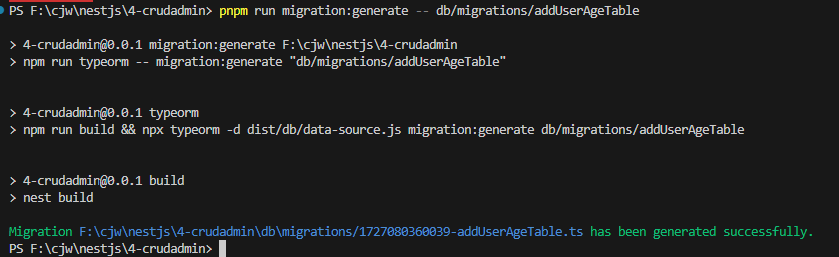


这样后 typeorm cli 会自动给我们生成一个我们指定在`db/migrations/addUserAgeTable` 路径下名为`{TIMESTAMP} -{name}.ts`的迁移文件

```typescript
import { MigrationInterface, QueryRunner } from "typeorm";

export class AddUserAgeTable1727080360039 implements MigrationInterface {
  name = "AddUserAgeTable1727080360039";

  public async up(queryRunner: QueryRunner): Promise<void> {
    await queryRunner.query(`ALTER TABLE \`user\` ADD \`age\` int NOT NULL`);
  }

  public async down(queryRunner: QueryRunner): Promise<void> {
    await queryRunner.query(`ALTER TABLE \`user\` DROP COLUMN \`age\``);
  }
}
```

此时如果我们进入数据库查看，就会发现`user`表还没有`age`字段，需要进行`pnpm run migration:run`

```
pnpm run migration:run
```

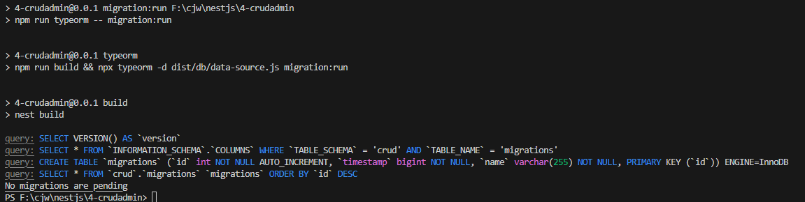

运行成功后，数据库中的`user`表没有多一个`age`字段，但多了一个 migrations 表


那是因为我们没有在`db`下的`data-source.ts`中绑定`migrations`字段

```typescript
export const dataSourceOptions: DataSourceOptions = {
  type: "mysql", //数据库类型
  username: "root", //账号
  password: "alice", //密码
  host: "localhost", //host
  port: 3306, //
  database: "crud", //库名
  entities: ["dist/**/*.entity.js"],
  migrations: ["dist/db/migrations/*.js"],
};
```

此时再运行`pnpm run migration:run`,就可以看到`migrations`表中迁移内容和`user`表中新增的`age`字段

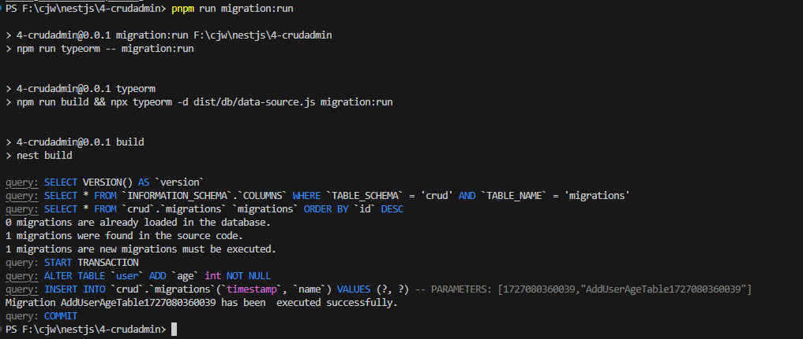

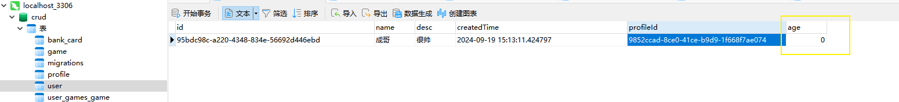

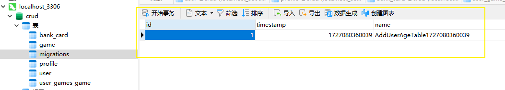


如果我们想回滚，运行`pnpm run migration:revert`，就行了
